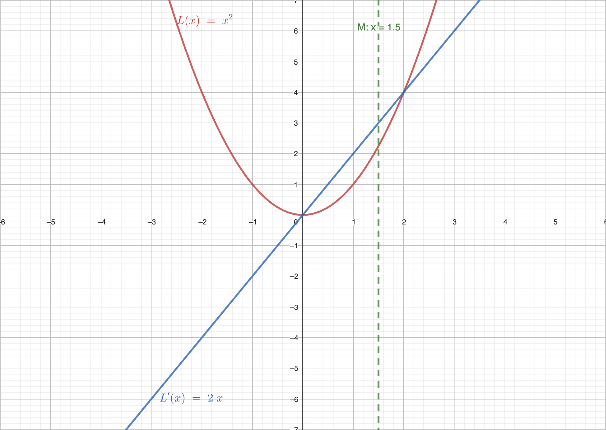

# 2.2 梯度下降 Gradient Descent

在上一节，我们通过线性回归了解了基础的监督学习的模型。我们定义了模型，成本函数，并尝试优化成本函数。优化成本函数使得我们的模型能够更好地完成任务（拟合数据）。在这一节，我们将介绍一个常用的优化算法：梯度下降（Gradient Descent）。其是一种更通用的方法用于最小化函数。

## 1. 梯度下降

初中和高中数学告诉我们，一个函数的斜率（即一阶导数）表示了函数的变化率。如果一个函数的斜率为正，那么函数在这一点上是递增的；如果一个函数的斜率为负，那么函数在这一点上是递减的。

对于函数 $f(x)$，如果我们在 $x=M$ 处有 $f'(x)=0$，且其是极大值，则我们可以得到：

| $x$ | $x<M$ | $x=M$ | $x>M$ |
| --- | --- | --- | --- |
| $f'(x)$ | $+$ | $0$ | $-$ |
| $f(x)$ | $\nearrow$ | 极大值 | $\searrow$ |

而如果是极小值，则有：

| $x$ | $x<M$ | $x=M$ | $x>M$ |
| --- | --- | --- | --- |
| $f'(x)$ | $-$ | $0$ | $+$ |
| $f(x)$ | $\searrow$ | 极小值 | $\nearrow$ |

梯度下降算法正是利用了这一点，通过不断地迭代，使得函数的值不断地减小。

我们假设我们需要寻找函数 $L(w)$ 的最小值，并且其的最小值与其的极小值重合。我们对其位于 $w_M$ 进行求导。因此我们可以得到三种情况：$L'<0$，$L'=0$，$L'>0$。

我们使用图像来表示这三种情况。其中红线表示函数 $L(w)$，蓝线表示导数 $L'(w)$。

情况 $L'>0$：

在这种情况下，导数大于 0。如果向右走，则函数的值增大，因此我们需要向左走。

情况 $L'<0$：

在这种情况下，导数小于 0。如果向左走，则函数的值增大，因此我们需要向右走。

情况 $L'=0$：

在这种情况，我们已经到达了极值点。

经过上述实验，我们会发现函数极小值方向总是相对于当前位置的导数相反。即如果导数为正，我们需要向左走；如果导数为负，我们需要向右走。因此我们得到了梯度下降的更新公式：

$$
\begin{align}
w &= w - \eta L'(w)\\
&= w - \eta \frac{d L}{d w}
\end{align}
$$

其中 $\eta$ 为学习率，其控制了我们每次更新的步长。越大的学习率，我们的步长越大，但是可能会导致我们错过最小值；越小的学习率，我们的步长越小，但是可能会导致我们收敛速度过慢。

如果考虑函数 $L$ 为多变量函数，我们则需要使用偏导替换导数。因此我们可以得到：

$$
\begin{align}
w &= w - \eta \frac{\partial L}{\partial w}
\end{align}
$$

但是考虑我们的参数 $\mathbf{w}$ 可能是一个向量，我们需要对每一个维度进行更新。因此我们可以得到：

$$
\begin{align}
\mathbf{w}_{(i)} &= \mathbf{w}_{(i)} - \eta\frac{\partial L}{\partial \mathbf{w}_{_{(i)}}}
\end{align}
$$

我们定义梯度 $\nabla L(\mathbf{w})$ 为：

$$
\nabla L(\mathbf{w}) = \begin{matrix}
    \begin{bmatrix}
        \frac{\partial L}{\partial \mathbf{w}_{(1)}}\\
        \frac{\partial L}{\partial \mathbf{w}_{(2)}}\\
        \vdots\\
        \frac{\partial L}{\partial \mathbf{w}_{(n)}}
    \end{bmatrix}
\end{matrix}
$$

则我们可以得到最终的更新公式：

$$
\begin{align}
\mathbf{w} &= \mathbf{w} - \eta \nabla L(\mathbf{w})
\end{align}
$$

## 疑问

相信看到这的时，你一定有很多困惑。我将先解释几个最常见的问题。

**Q: 如果我的函数极值点不是唯一的，梯度下降会怎么样？**

梯度下降会收敛到一个局部最小值（即极值点）。这是因为梯度下降是一种贪心算法，其只会考虑当前的梯度，而不会考虑全局的梯度。

而解决的方法通常是一个叫“多次启动”的东西。其的做法是随机初始化参数，然后运行梯度下降。重复这个过程多次，然后选择最小的那个值。

**Q: 如果我学到了极大值咋整？**

在上述我们还有一种可能就是直接学习学到了 $\nabla L = 0$ 且这个点是 $L$ 的极大值。这种情况通常建议去买个彩票（x）。使用多次启动可以解决这个问题。

**Q：什么情况下梯度下降会失效？**

梯度下降的一个前提是函数是可微的。如果函数不可微，梯度下降会失效。另外，如果函数的梯度变化很大，梯度下降也会失效。这种情况下，我们可以使用其他的优化算法，例如 IRLS。

**Q：什么情况下梯度下降一定会收敛到最小值？**

如果函数是凸函数，梯度下降一定会收敛到最小值。这是因为凸函数的局部最小值就是全局最小值。

（这个答案对欧皇无效）

## 原理：梯度下降为什么总是能走向最深的点

> 本节内容为高阶内容，如果你对数学不感兴趣，可以跳过这一节。

梯度下降的本质推导来源于泰勒展开。泰勒展开是一个非常重要的数学工具，它可以将一个函数在某一点附近用一个多项式来近似表示。泰勒展开的公式如下：

$$
\begin{align}
f(x) 
&=\sum_{n=0}^\infty\frac{f^{(n)}(x_0)}{n!}(x-x_0)^n
\\
&= f(x_0) + f'(x_0)(x-x_0) + \frac{f''(x_0)}{2!}(x-x_0)^2 + \cdots + \frac{f^{(n)}(x_0)}{n!}(x-x_0)^n
\end{align}

$$

其将函数在 $x_0$ 处使用多阶导数展开，展开的多项式的次数为 $n$。换句话说如果我们一级展开，我们则需要使用 0 阶导数（函数值）和一阶导数（斜率）；如果我们二级展开，我们则需要使用 0 阶导数 $f^{(0)}(x) = f(x)$（函数值）、一阶导数 $f^{(1)}(x) = f'(x)$（斜率）和二阶导数 $f^{(2)}(x) = f''(x)$（曲率，或者说，导数的导数）以此类推。

上图是对函数 $f(x) = \cos(x)$ 位于 $x_0=1$的泰勒展开。其中红线为原函数，紫线为一阶泰勒展开，蓝线为二阶泰勒展开，橙线为三阶泰勒展开，绿线为四阶泰勒展开。我们可以看到，随着泰勒展开的次数增加，展开的多项式越接近原函数。

通过上图，我们也能发现泰勒展开的两个非常有用的性质：

1. 当我们需要拟合的点 $x$ 离展开点 $x_0$ 越近，泰勒展开后的结果 $T_n(x)$ 越接近原函数的值 $f(x)$。
2. 当泰勒展开次数越高，拟合的效果越好。

我们假设 $L$ 为损失函数，我们认为 $\mathbf{w}$ 为最优权重。我们期望从 $\mathbf{w}_0$ 达到最优权重  $\mathbf{w}$ 。我们对损失函数 $L(\mathbf{w})$ 位于 $\mathbf{w}_0$ 进行一阶泰勒展开，即：

$$
\begin{align}

L(\mathbf{w}) 
&\approx L(\mathbf{w}_0) + L'(\mathbf{w}_0)(\mathbf{w}-\mathbf{w}_0)
\\
&= L(\mathbf{w}_0) + \nabla L(\mathbf{w}_0)(\mathbf{w}-\mathbf{w}_0)
\end{align}
$$

如果我们认为更新后的权重 $\mathbf{w}$ 是 $\mathbf{w}_0$ 增加一个单位向量 $\mathbf{v}$ 伴有学习率 $\eta$，则可以写成

$$
\begin{align}
\mathbf{w} &= \mathbf{w}_0 + \eta \mathbf{v}
\end{align}
$$

我们可以将上式代入到损失函数的泰勒展开中，得到：

$$
\begin{align}
L(\mathbf{w}) &\approx L(\mathbf{w}_0)+ \nabla L(\mathbf{w}_0)(\mathbf{w}-\mathbf{w}_0)\\
&= L(\mathbf{w}_0)+ \nabla L(\mathbf{w}_0)(\mathbf{w}_0 + \eta \mathbf{v}-\mathbf{w}_0)\\
&= L(\mathbf{w}_0) + \eta \nabla L(\mathbf{w}_0)^T\mathbf{v}\\
\end{align}
$$

我们可以认为 $\nabla L(\mathbf{w}_0)^T\mathbf{v}$ 是损失函数在 $\mathbf{w}_0$ 处的梯度与更新的方向 $\mathbf{v}$ 的点积。

$$
\nabla L(\mathbf{w}_0)^T\mathbf{v} = ||\nabla L(\mathbf{w}_0)||\cdot||\mathbf{v}||\cdot\cos\theta
$$

其中 $\theta$ 是 $\nabla L(\mathbf{w}_0)$ 与 $\mathbf{v}$ 的夹角。

考虑单位向量 $\mathbf{v}$，其的膜长为1，即 $||\mathbf{v}||=1$。因此我们可以得到：

$$
\nabla L(\mathbf{w}_0)^T\mathbf{v} = ||\nabla L(\mathbf{w}_0)||\cos\theta
$$

如果假设 $\nabla L(\mathbf{w}_0)$ 的膜长不变，则其的点积越大，说明 $\theta$ 越小，也就是说我们的更新方向越接近于梯度的方向。

根据三角函数的定理，我们可以地到 $\cos \theta\in [-1, 1]$，其最小值当且仅当 $\theta=\pi$ 时取到，而其最大值则为 $\theta=0$ 时取到。因此我们可以得到：

$$
\nabla L(\mathbf{w}_0)^T\mathbf{v} = ||\nabla L(\mathbf{w}_0)||\cos\theta\in [
    -||\nabla L(\mathbf{w}_0)||,
    ||\nabla L(\mathbf{w}_0)||
]
$$

我们的目标是使 $L(\mathbf{w})$ 最小化，也就是说我们希望 $\nabla L(\mathbf{w}_0)^T\mathbf{v}$ 最小化。因此我们可以得到结论：当 $\mathbf{v}$ 与 $\nabla L(\mathbf{w}_0)$ 的夹角为180°（即 $\pi$）时，$L(\mathbf{w})$ 取得最小值。即 $\mathbf{v}$ 与 $\nabla L(\mathbf{w}_0)$ 反向时，$L(\mathbf{w})$ 取得最小值。

考虑 $\mathbf{v}$ 为 $\nabla L(\mathbf{w}_0)$ 的反向，且为单位向量我们可以得到：

$$
\begin{align}
\mathbf{v} &= -\frac{\nabla L(\mathbf{w}_0)}{||\nabla L(\mathbf{w}_0)||}\\
\end{align}
$$

将其代入至原函数：

$$
\begin{align}
\mathbf{w} &= \mathbf{w}_0 + \eta \mathbf{v}\\
&= \mathbf{w}_0 - \eta\frac{\nabla L(\mathbf{w}_0)}{||\nabla L(\mathbf{w}_0)||}\\
\end{align}
$$

考虑 $||\nabla L(\mathbf{w}_0)||$ 是一个标量，我们可以令 $\eta = \frac{\eta}{||\nabla L(\mathbf{w}_0)||}$，则可得：

$$
\begin{align}
\mathbf{w} &= \mathbf{w}_0-\eta\nabla L(\mathbf{w}_0)\\
\end{align}
$$

因此我们可以证明出最终的结论：梯度下降总是能走向最深的点。

## 拓展：IRLS

> 本节内容为高阶内容，如果你对数学不感兴趣，可以跳过这一节。

如果将泰勒展开展开至二阶，则有

$$
\begin{align}
T_n(\mathbf{w})

&=\sum^n_{k=0}\frac{L^{(k)}(\mathbf{w}_0)}{k!}(\mathbf{w}-\mathbf{w}_0)^k\\

&=
\frac{L^{(0)}(\mathbf{w}_0)}{0!}(\mathbf{w}-\mathbf{\mathbf{w}}_0)^0+
\frac{L^{(1)}(\mathbf{w}_0)}{1!}(\mathbf{w}-\mathbf{\mathbf{w}}_0)^1+
\frac{L^{(2)}(\mathbf{w}_0)}{2!}(\mathbf{w}-\mathbf{\mathbf{w}}_0)^2

\\

&=L(\mathbf{w}_0)+(\mathbf{w}-\mathbf{w}_0)L(\mathbf{w}_0)+\frac{(\mathbf{w}-\mathbf{w}_0)^2}{2}L''(\mathbf{w}_0)
\end{align}

$$

令其导数为0，我们可以得到

$$
\begin{align}
\frac{\partial L}{\partial \mathbf{w}} 
\approx \frac{\partial}{\partial w}
L(\mathbf{w}_0)+(\mathbf{w}-\mathbf{w}_0)L(\mathbf{w}_0)+\frac{(\mathbf{w}-\mathbf{w}_0)^2}{2}L''(\mathbf{w}_0) &=0\\

\frac{\partial}{\partial \mathbf{w}}
L(\mathbf{w}_0)+(\mathbf{w}-\mathbf{w}_0)L(\mathbf{w}_0)+\frac{(\mathbf{w}-\mathbf{w}_0)^2}{2}L''(\mathbf{w}_0)
&=0\\

L'(\mathbf{w}_0)+wL''(\mathbf{w}_0)-\mathbf{w}_0L''(\mathbf{w}_0)&=0\\

L'(\mathbf{w}_0)+(\mathbf{w}-\mathbf{w}_0)L''(\mathbf{w}_0)&=0\\
\mathbf{w}-\mathbf{w}_0&=-\frac{L'(\mathbf{w}_0)}{L''(\mathbf{w}_0)}\\
\mathbf{w}&=\mathbf{w}_0- \frac{L'(\mathbf{w}_0)}{L''(\mathbf{w}_0)}\\
\mathbf{w}'&=\mathbf{w}-\frac{L'(\mathbf{w}_0)}{L''(\mathbf{w}_0)}
\end{align}
$$

即在二阶泰勒展开中，我们认为损失函数 $L$ 的最低点可以由 $\mathbf{w}'=\mathbf{w}-\frac{L'(\mathbf{w}_0)}{L''(\mathbf{w}_0)}$ 得到。而 $\frac{L'(\mathbf{w}_0)}{L''(\mathbf{w}_0)}$ 可以看作是 $\mathbf{w}$ 的更新方向。

因此我们可以定义新的梯度下降函数为

$$
\begin{align}
\mathbf{w} &= \mathbf{w} - \eta \frac{L'(\mathbf{w}_0)}{L''(\mathbf{w}_0)}\\
&=\mathbf{w} - \eta\frac{\nabla L(\mathbf{w}_0)}{H_L(\mathbf{w}_0)}\\
&=\mathbf{w} - \eta H_L^{-1}(\mathbf{w}_0)\nabla L(\mathbf{w}_0)
\end{align}
$$

其中 $H$ 为 Hessian 矩阵，$H_L^{-1}$ 为 Hessian 矩阵的逆矩阵。

TODO

我们将新的更新公式命名为 IRLS（Iteratively Reweighted Least Squares）算法。其是一种迭代的最小二乘法，其在每次迭代中都会重新计算权重。

