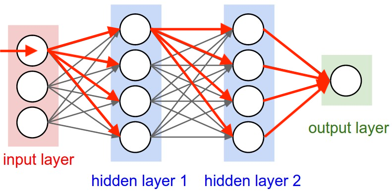

# 多层感知机（MLP）aka FFNet

多层感知机（Multilayer Perceptron, MLP）又叫前馈神经网络（Feed-Forward Network, FFNet）是一个通过多个层组成的神经网络，每个层有多个神经元。其拥有输入层、隐藏层和输出层。每个神经元接收上一层的输出，通过加权和激活函数输出到下一层。如果这个网络拥有超过一层隐藏层，我们则称之为深度神经网络（Deep Neural Network, DNN）。

## 工作机制

上图表示了输入层第一个元素向前传播（forward pass）的过程。输入层接收输入信号，通过加权和激活函数输出到隐藏层。隐藏层接收上一层的输出，通过加权和激活函数输出到下一层。输出层接收隐藏层的输出，通过加权和激活函数输出到输出层。

## 全连接层（FC Layer）

TODO

## 激活函数

## 优化

如果我们把原图中的输出当作预测值，最直觉的方法我们可以通过计算预测值和真实值的差距来优化网络。我们可以通过梯度下降来优化网络。

但是我们应该怎么样去求梯度变成了问题，我们可以通过反向传播（Backpropagation）来求解。反向传播是一种通过计算图的方式来求解梯度的方法。我们可以通过链式法则来求解梯度。我们将在下一章介绍。