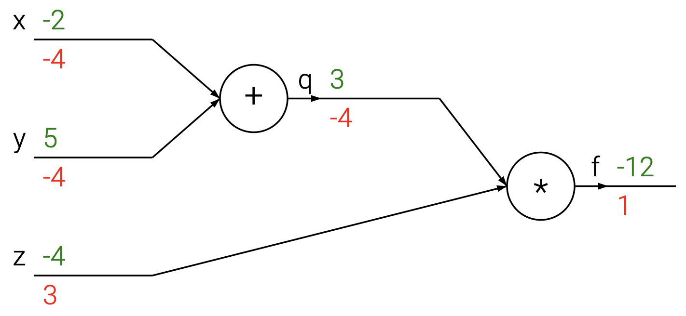
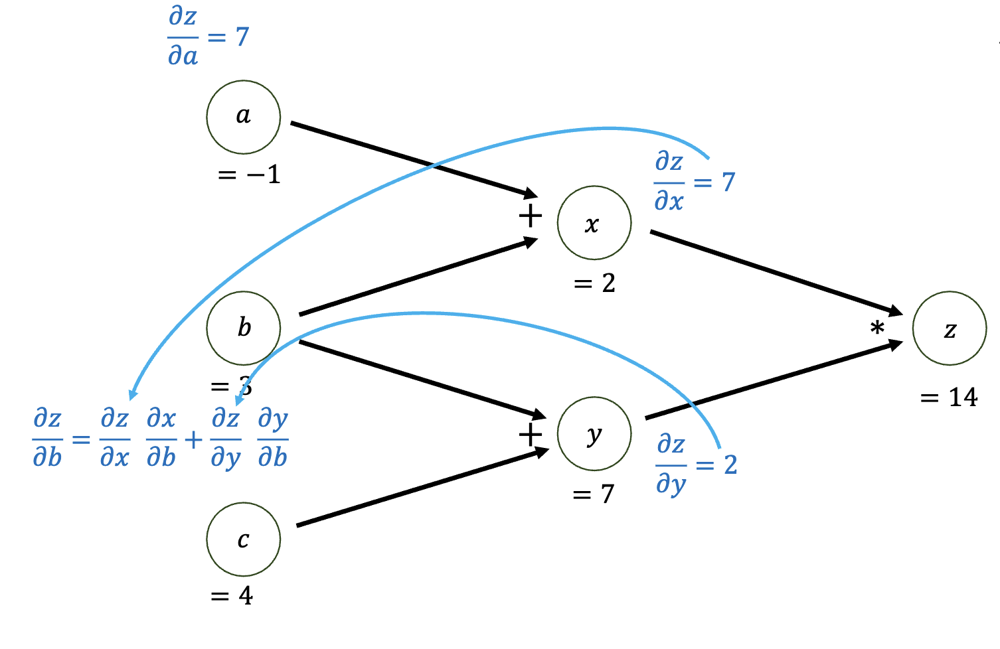

# 计算图与反向传播

对模型数学层面求其解析导，对于更复杂的模型是难以实现的。例如MLP，如果我们有很多层，例如 100 层，手动求其导数是没可能的。因此我们需要一种自动求导的方法，这就是反向传播。

## 计算图

计算图（Computational Graph）是一种直观的表示模型的方法。我们可以通过计算图来表示模型的计算过程。

[https://cs231n.github.io/optimization-2/]

上图是一个简单的计算图。其中绿色数字表示正向计算用的数字，而红色则是反向传播的数字，我们将在后文讨论反向传播，现在我们将更关注正向计算的数字，即绿色的。计算图中的节点表示计算，边表示计算之间的依赖关系。图中最左侧的节点是输入节点，最右侧的节点是输出节点。其描述的运算是：

$$
\begin{align}
x &= -2\\
y &= 5\\
q = x + y &= 3\\
\\
z &= -4\\
f = q \times z &= -12
\end{align}
$$

计算图将一组复杂的计算过程分解为一系列简单的计算过程，这样方便我们后面的求导。

尽管现在深度学习有很多框架，包括 PyTorch、Keras 等，但是这些框架所使用的自动求导的方法都是基于计算图并使用反向传播进行计算。

## 反向传播

在拥有了计算图后，我们仍然不能获得我们所需要的梯度。我们需要使用反向传播（Backpropagation）来计算梯度。

我们仍然考虑上图作为反向传播的例子。我们假设输出为 $f$，输入为 $x$、$y$ 和 $z$。我们需要计算 $\frac{\partial f}{\partial x}$ 、 $\frac{\partial f}{\partial y}$ 和 $\frac{\partial f}{\partial z}$。对于输出 $f$，其依赖了 $q$、$z$、 $x$、$y$。我们需要计算 $f$ 对于 $q$、$z$ 和 $x$、$y$ 的偏导。

我将以 $\frac{\partial f}{\partial x}$ 为例来说明反向传播的过程。

考虑偏导的链式法则（chain rule）：
$$
\frac{\partial f}{\partial x} = \frac{\partial f}{\partial q}\frac{\partial q}{\partial x}
$$

我们为了求 $\frac{\partial f}{\partial x}$，我们通过链式法则可以得：

$$
\begin{align}
\frac{\partial f}{\partial x} &= \frac{\partial f}{\partial q}\frac{\partial q}{\partial x}\\
&= \frac{\partial}{\partial q}(q \times z) \times \frac{\partial}{\partial x}(x + y)\\
&= z \times 1\\
&=z
\end{align}
$$

下图是另一个计算 $z = x \times y = (a + b) \times c$ 的计算图。以及其反向传播的过程。

上图由于对于变量 $z$ 对于目标 $b$ 有两个依赖 $x$ 和 $y$，即 $\frac{\partial z}{\partial x}$ 和 $\frac{\partial z}{\partial y}$。为了向前计算，我们对这两个分支分别对 $b$ 使用链式法则，因并将两个梯度相加。即，我们可以把这个过程写为：

$$
\begin{align}
\frac{\partial f}{\partial t} &= \sum^n_{i=1} \frac{\partial f}{\partial z_i} \frac{\partial z_i}{\partial t}
\end{align}
$$

我们称上面的公式为多变量链式法则（Multivariable Chain Rule）。这个公式可以用来计算多个变量对于目标的梯度。

而对于下图的计算图，因为只有一个依赖则无所谓。

[COPYRIGHT]

[https://cs231n.github.io/optimization-2/]

## 总结

通过上述简单的例子，我们可以看到反向传播的过程。我们可以通过计算图来表示模型的计算过程，然后通过链式法则来计算梯度。这样我们就可以通过计算图和反向传播来自动求解梯度。

而我们在反向传播会遇到两种不同的情况：
1. 单变量依赖
2. 多变量依赖

我们分别使用单变量链式法则和多变量链式法则来计算梯度:

| 单变量依赖 | 多变量依赖 |
| :---: | :---: |
| $\frac{\partial f}{\partial x} = \frac{\partial f}{\partial q}\frac{\partial q}{\partial x}$ | $\frac{\partial f}{\partial x} = \sum^n_{i=1} \frac{\partial f}{\partial z_i} \frac{\partial z_i}{\partial x}$ |
