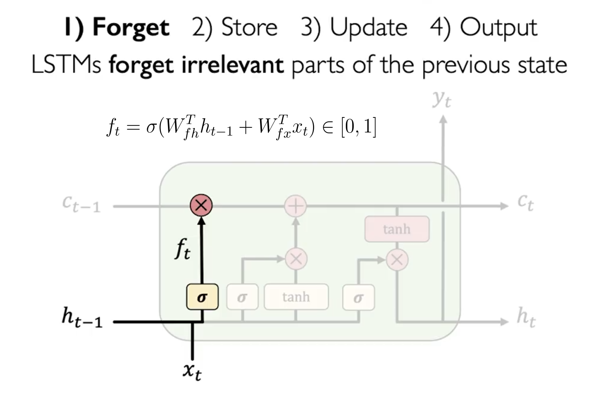

# 长短时记忆网络 LSTM

LSTM（Long Short-Term Memory）网络是一种特殊的 RNN，它的设计是为了解决 RNN 中的梯度消失和梯度爆炸问题，其还能优化长期依赖的问题。

上面两张图分别是 RNN 和 LSTM 的示意图，可以看到 LSTM 的结构更加复杂，引入了更多的元素来控制信息的流动。而更重要的是，其比 RNN 多了一整条信息流（横向）。

## 模型

LSTM 的结构如下图所示：

相比于 RNN 只使用 $h$ 用于保存信息流，LSTM 新增了一个 $c$ 来保存长期信息。

LSTM 的计算总结来说有 4 个不同的状态：遗忘，存储，更新和输出。

### 遗忘门 Forget Gate

其是为了计算长期记忆 $c_{t-1}$ 保留多少信息。其计算公式如下：

$$
f_t = \sigma(W_{fh}h_{t-1} + W_{fx}x_t)
$$

这个公式的意义是，我们需要计算一个遗忘门 $f_t$，其值在 0 到 1 之间，用于控制 $c_{t-1}$ 保留多少信息。当 $f_t$ 接近 0 时，表示忘记所有信息；当 $f_t$ 接近 1 时，表示保留所有信息。

### 记忆门 Store Gate

这一步，LSTM 将计算有多少比例的新信息 $i_t$ 要被加入到长期记忆中 $c$。其计算公式如下：

$$
i_t = \sigma(W_{ih}h_{t-1} + W_{ix}x_t)\\
\tilde{c}_t = \tanh(W_{ch}h_{t-1} + W_{cx}x_t)
$$

### 更新 Update

这一步，LSTM 将计算新的长期记忆 $c_t$。其计算公式如下：

$$
c_t = f_t \cdot c_{t-1} + i_t cdot \tilde{c}_t
$$

其中 $f_t$ 是遗忘门（记忆比例），$i_t$ 是存储门（存储比例），$\tilde{c}_t$ 是新的信息。

### 输出门 Output Gate

输出门 $o_t$ 控制着输出 $h_t$ 的信息量。其计算公式如下：

$$
o_t = \sigma(W_{oh}h_{t-1} + W_{ox}x_t)\\
h_t = o_t \cdot \tanh(c_t)
$$

和 RNN 类似，$y_t$ 输出为：

$$
y_t = W_{hy}h_t
$$

## 训练

LSTM 的训练过程与 RNN 类似，我们可以使用梯度下降法来更新参数。使用 BPTT 算法来计算梯度。LSTM尽管引入了很多新的元素，但这并不影响最终的梯度是连续的，因此我们可以使用梯度下降法来更新参数。