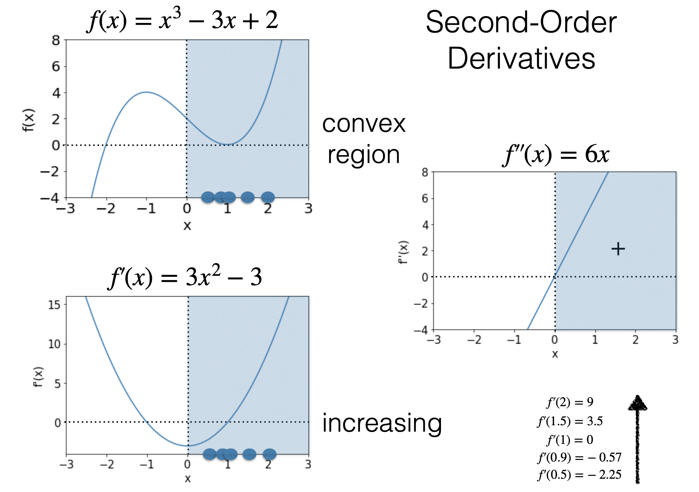

# 凸函数（Convex）

## 定义

[https://en.wikipedia.org/wiki/Convex_function#/media/File:ConvexFunction.svg]

对于所有在 $f$ 定义域内的 $x_1, x_2$ 且 $0 \leq \lambda \leq 1$，有：

$$
f(\lambda x_1 + (1-\lambda)x_2) \leq \lambda f(x_1) + (1-\lambda)f(x_2)\\
$$

则函数 $f$ 是凸函数。

而如果在此基础上，当 $x_1 \neq x_2$ 时，有：
$$
f(\lambda x_1 + (1-\lambda)x_2) < \lambda f(x_1) + (1-\lambda)f(x_2)\\
$$
则函数 $f$ 是严格的凸（strictly convex）函数。

其很好理解，左侧表示函数（图中黑线）在 $x_1, x_2$ 区域的值，右侧表示线段的线性插值（图中玫红色值）。凸函数的定义即为：在 $x_1, x_2$ 区域，函数上的值不会超过线性插值。

[Prof. Leandro L. Minku's slides]

凸函数有一个很有用的性质：凸函数的局部最小值也是全局最小值。  
并且如果函数是严格凸的，那么局部最小值是唯一的。

而对于凹函数，只需要将不等号反过来即可。即：
$$
f(x) \text{ is concave} \leftrightarrow -f(x) \text{ is convex}
$$

## 1 阶导

函数 $f$ 是凸函数，**当且仅当**对于其定义域 $C$ 为凸集且所有 $x^{(0)}, x\in C$ 满足：

$$
f(x)\geq f(x^{(0)})+\nabla f(x^{(0)})\cdot(x-x^{(0)})
$$

## 2 阶导

函数 $f$ 是凸函数，**当且仅当** $C$ 是凸集并且其 $H_f(x)$ （海森矩阵）对于任何 $x\in C$ 是半正定的（Positive Semidefinite, PSD）

如果（不是iff） $C$ 是凸集并且其 $H_f(x)$ 对于任何 $x\in C$ 是正定（Positive Definite, PD）的，则 $f$ 为严格凸函数。

$$
H_f(x) = \begin{bmatrix}
\frac{\partial^2 f}{\partial x_1^2} & \frac{\partial^2 f}{\partial x_1 \partial x_2} & \cdots & \frac{\partial^2 f}{\partial x_1 \partial x_n} \\
\frac{\partial^2 f}{\partial x_2 \partial x_1} & \frac{\partial^2 f}{\partial x_2^2} & \cdots & \frac{\partial^2 f}{\partial x_2 \partial x_n} \\
\vdots & \vdots & \ddots & \vdots \\
\frac{\partial^2 f}{\partial x_n \partial x_1} & \frac{\partial^2 f}{\partial x_n \partial x_2} & \cdots & \frac{\partial^2 f}{\partial x_n^2}
\end{bmatrix}
$$

### 单变量场景

| 凸函数 | 凹函数 |
| --- | --- |
| 函数是凸的 $\leftrightarrow\forall x. f''(x)\geq 0$ | 函数是凹的 $\leftrightarrow \forall x. f''(x)\leq 0$ |
| $f$ 是凸的 $\rightarrow$ $-f$ 是凹的 | $f$ 是凹的 $\rightarrow$ $-f$ 是凸的 |
| $\forall x. f''(x)>0\rightarrow$ $f$ 是严格凸的 | $\forall x. f''(x)<0\rightarrow$ $f$ 是严格凹的 |
| $f'(x)= 0 且 f''(x)>0\rightarrow$ $f(x)$ 的局部最小值 | $f'(x)= 0 且 f''(x)<0\rightarrow$ 是 $f(x)$ 的局部最大值 |

### 多变量场景

函数是凸的 iff $\forall x.f’’(x)\geq 0$ **不再适用**。

$$\Downarrow$$

函数是凸的 iff $\forall x.H_f(x)\succcurlyeq 0$  （半正定，PSD）

**半正定被定义为：**

对称（symmetric）方阵（ $d\times d$ ） $A$ 是半正定的，当且仅当：

$$
\forall z\in\mathbb{R}^d, z\neq0.\\
z^T A z \geq 0
$$

需要注意的是，如果一个 $H_f(x)$ 全为正数，也可能不是PSD。存在负数也不代表不能为 PSD。