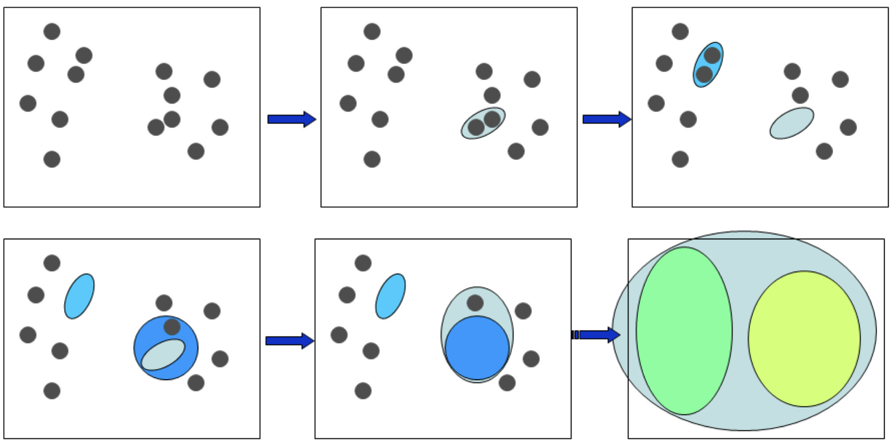
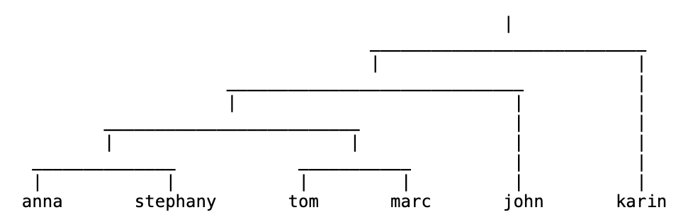
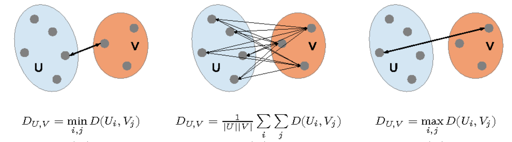

# 层次聚类 Hierarchical Clustering

层次聚类算法非常简单。它的主要思想是将数据集中的每个数据点视为一个单独的类，然后逐渐合并这些类，直到所有数据点都在一个类中。

> 💡 亲手试试看这个算法：<https://jydelort.appspot.com/resources/figue/demo.html>

算法实现为：

1. 将所有点视作一个类。
2. 计算每个类之间的距离。
3. 取距离最近的两个类合并。
4. 重复直到所有点只在一个类里。

[ttps://jydelort.appspot.com/resources/figue/demo.html]

最终的输出会是如上图类似的树状图（dendrogram）。

而上面算法有一个非常明显的问题，即如果一个类里如果有很多点，我们应该怎么计算其与其他类的距离呢？

我们有3种策略，可以根据情况选择：

[https://www.semanticscholar.org/paper/Statistical-and-machine-learning-methods-to-analyze-The/27822318f2c8dbf5f92a4bd31d395bcca7db45cb]

## Single-Linkage (SL)

SL 策略是将两个类中最近的两个点之间的距离作为两个类之间的距离。因此其公式可以写为

$$
\text{Dist}_{SL}(U, V)=\min_{u \in U, v \in V} \text{dist}(u, v)
$$

## Complete-Linkage (CL)

CL 策略是将两个类中最远的两个点之间的距离作为两个类之间的距离。因此其公式可以写为

$$
\text{Dist}_{CL}(U, V)=\max_{u \in U, v \in V} \text{dist}(u, v)
$$

## Group Average

Group Avarage 策略是将两个类中所有点之间的距离的平均值作为两个类之间的距离。因此其公式可以写为

$$
\text{Dist}_{GA}(U, V)=\frac{1}{|U||V|}\sum_{u \in U}\sum_{v \in V} \text{dist}(u, v)
$$

而这其中 Group Average 是最常用的策略。因为其可以很好的对抗噪声。

## 优势、劣势和注意事项

**优点**
- 提供确定性结果
- 无需事先指定聚类的数量
- 可以创建任意形状的聚类

**缺点**  
- 无法扩展大型数据集，时间复杂度至少为 $O(N^2)$

**注意事项**
- 不同的相似度算法（距离公式）会导致不同的结果
- 算法会对数据施加层次结构，即使这种结构并不适合数据。