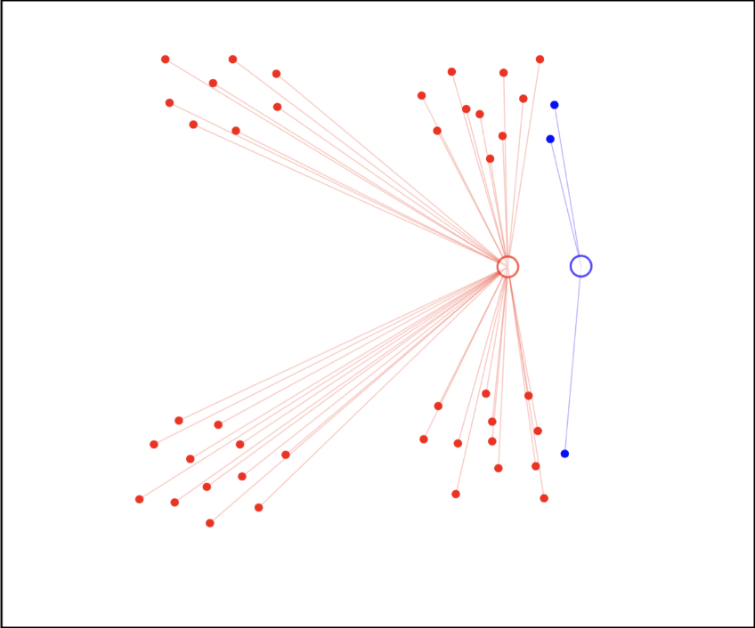
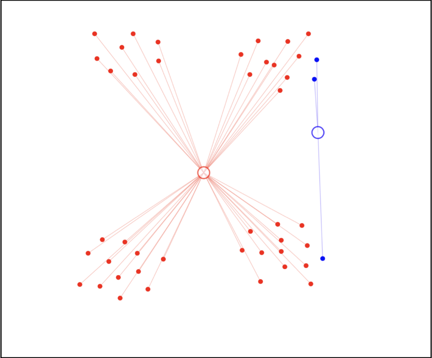
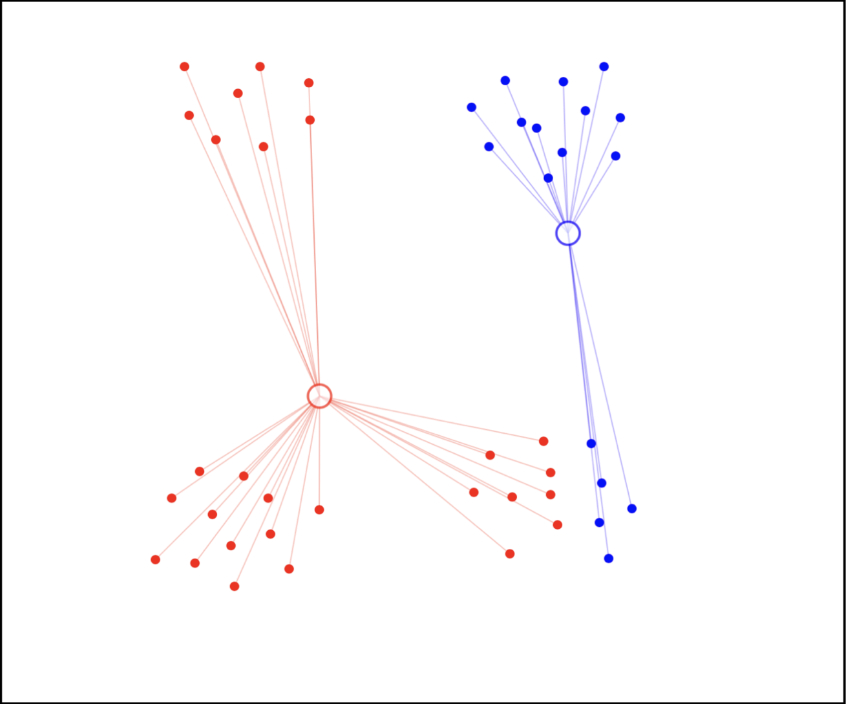
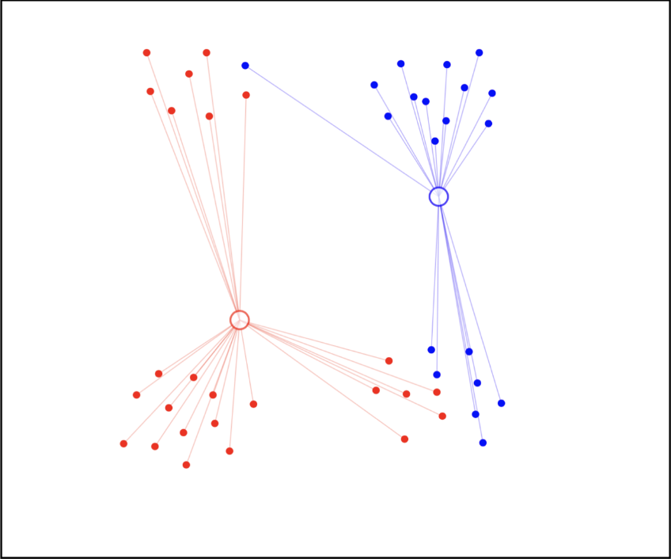
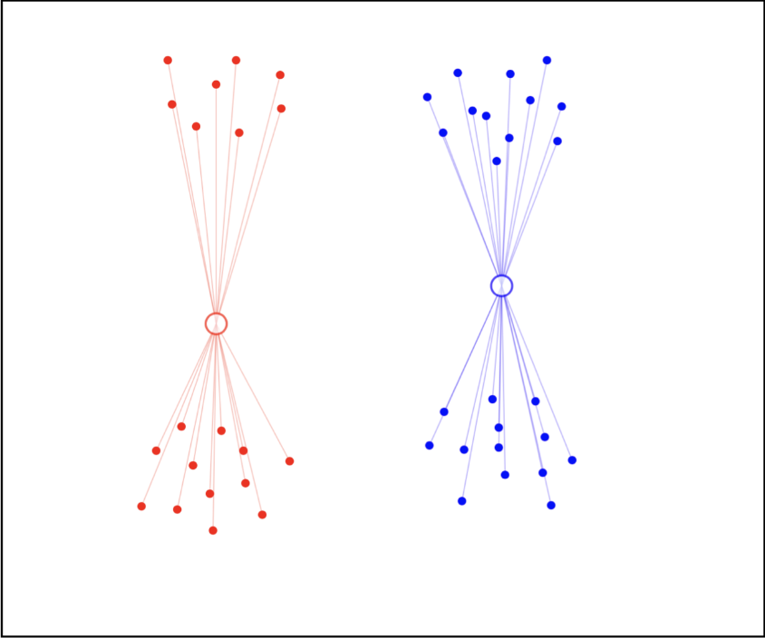
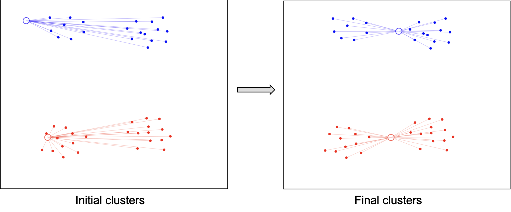

# K均值 K-means

[Material Adapted from Dr. Shuo Wang @ UoB]

K均值算法的核心思想是用平均值描述每个聚类。对于聚类 $c$，其平均值被定义为

$$
\mu_c = \frac{1}{|c|}\sum_{\mathbf{x}\in c}\mathbf{x}
$$

其算法目标是最小化所有聚类的聚类内方差。我们可以将方差认为是所有点到均值的距离的平方和。

## 算法

K 均值算法并不复杂。我们以 $K=2$ 为例：

**步骤 1：初始化聚类并分配**

随机初始化 $K$ 个聚类中心 $\mu_1, \mu_2, ..., \mu_K$。如图，我们初始化两个聚类中心。

对于每个数据点 $\mathbf{x}$，计算其到每个聚类中心的距离，然后将其分配到距离最近的聚类中心。

**步骤 2：调整聚类中心**

根据每个聚类中的数据点，计算其不同维度的平均值，然后将其作为新的聚类中心。

**步骤 3：重新分配数据点**

和步骤 1 类似，我们重新计算每个数据点到新的聚类中心的距离，然后重新分配数据点到最近的聚类中心点。

**步骤 4：重新调整聚类中心**

和步骤 2 一致，我们重新计算每个聚类中心的平均值作为新的聚类中心。

**步骤 5：重复**

重复步骤 3 和 4 直到聚类中心不再变化。

## 不确定性 Non-determinism

上述算法非常简单，但是也存在问题：不同的初始化聚类中心，可能会有不同的聚类结果。如图是相同数据但是不同初始化的聚类结果。

因此多次启动通常是需要的。

## 算法定义

初始化：  
- 数据为 $\mathbf{x}_{1:N}$ : 有 N 个数据点
- 选择初始聚类均值 $\mu_{1:K}$，其与数据有相同维度

重复：
- 分配每个点到最近的聚类中心
  $$
  z_n = \argmin_{i\in K} \text{dist}(\mathbf{x}_n, \mu_i)
  $$
- 计算新的聚类中心
  $$
  \mu_k = \frac{1}{N_k}\sum_{n:z_n=k}\mathbf{x}_n
  $$

直到分配 $z_{1:N}$ 不再发生变化。
