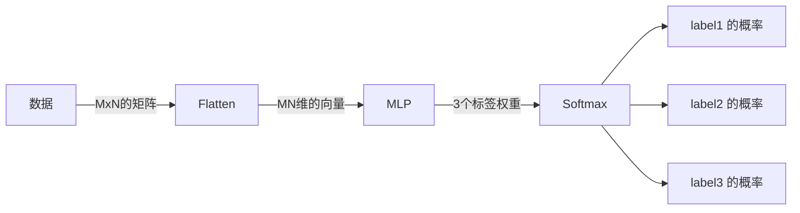

# 层（Layer）

层的概念其实在很早的逻辑回归我们就以接触。逻辑回归中我们将数据先经过线性组合得新的空间，再通过sigmoid函数将这个空间映射到概率空间。如果我们将其分成两部分，则可以认为其本质上是一层线性层后跟上一个sigmoid层。

而现代深度神经网络通过将不同组件模块化实现类似的功能。
例如对于一组数据，其每个元素为 MxN 的矩阵，而我们期望将其输入到 MLP，并期望神经网络能将其分类为3类。

我们可以将其先拍平成一个 $M\times N$ 维的向量并将其输入进 MLP。而这个拍平操作也被表示为一个层，通常为 `nn.Flatten`。

而MLP则可以将其看作一个函数，其输入为 $M\times N$，其输出为 3 个标量表示不同分类的权重。

最后将结果放入一个 Softmax 层，得到不同分类的概率。



使用 Torch 代码表示则为

```python
import torch.nn as nn

M = 28
N = 28


model = nn.Sequential(
            # Flatten matrix to vector
            nn.Flatten(),

            # MLP
            nn.Linear(M * N, 128),
            nn.ReLU(),
            nn.Linear(128, 32),
            nn.ReLU(),
            nn.Linear(32, 3),

            # Softmax
            nn.Softmax(dim=1)
        )
```