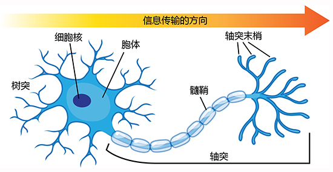
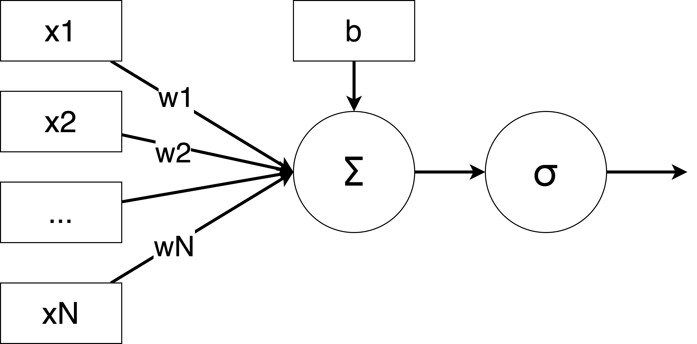
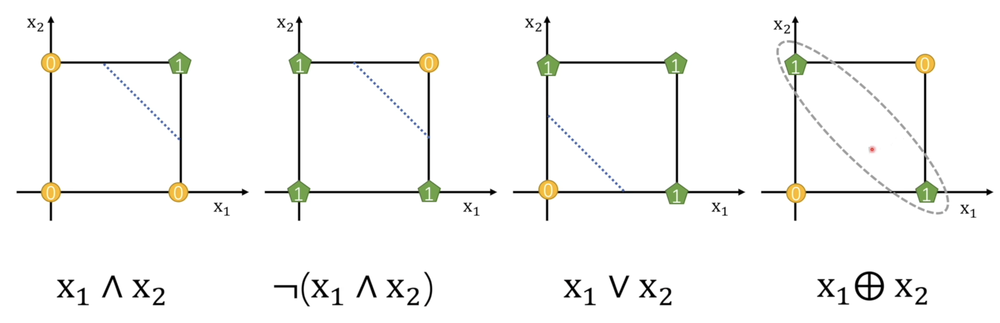

# 感知机（Perceptron）


感知机是深度学习中最重要的单元之一，其意图在模拟一个神经元的工作原理。



上图是一个神经元的示意图。神经元从树突接收输入信号，通过轴突传递输出信号。在神经元内部，输入信号被加权。如果加权和超过了一个阈值，神经元激活，输出信号；否则神经元不激活，不输出信号。

而感知机就是模拟这个过程。感知机接收输入信号，通过加权和激活函数输出信号。



上图是一个感知机的示意图。感知机接收输入信号 $x$，通过加权 $w$求和（再加上bias），然后通过激活函数 $\sigma$ 来决定是否有值输出。

## 定义

我们可以将感知机定义为：

$$
\begin{align}
f(x) 
&= \sigma\left(\sum_{i=1}^n \mathbf{w}_{(i)}\mathbf{x}_{(i)}+b\right)\\
&= \sigma(\mathbf{w}^T\mathbf{x}+b)\\
&= \sigma(\mathbf{w}^T\mathbf{x})

\end{align}

$$

而其中的 $\sigma$ 为激活函数，常用的有 Sigmoid 函数、ReLU 函数等。

不难发现，感知机的定义和逻辑回归的定义非常相似。实际上，逻辑回归就是一个特殊的感知机。

## 激活函数

激活函数决定了神经元的输出。在最初的神经元中，激活函数是一个阶跃函数，即：

$$
\sigma(x) = \begin{cases}
1 & x > 0\\
0 & x \leq 0
\end{cases}
$$

如果输入信号的加权和大于 0，神经元激活，输出 1；否则神经元不激活，输出 0。

但是阶跃函数不连续，不可导，因此不适合在神经网络中使用。因此我们通常使用其他的激活函数。和逻辑回归不同的是，感知机的激活函数有很多可选项。常用的激活函数有：

TODO: 激活函数的图像

Sigmoid 函数：

$$
\sigma(x) = \frac{1}{1+e^{-x}}
$$

ReLU 函数：

$$
\sigma(x) = \max(0, x)
$$

Leaky-ReLU 函数：

$$
\sigma(x) = \max(0.01x, x)
$$

Tanh 函数：

$$
\sigma(x) = \tanh(x)
$$

## 优化

```admonish info title=""
我们暂时不讨论关于感知机的优化问题，因为单个感知机的优化问题和逻辑回归的优化问题非常相似。我们将在之后章节讨论关于神经网络的优化问题。
```

## XOR 问题

我们可以把单个感知机看作一个线性分类器，其只能产生线性可分的分类结果。考虑二进制运算 AND, OR, XOR，我们可以发现 AND 和 OR 都是线性可分的，而 XOR 则不是线性可分的。



这里用 $\neg$ 表示 NOT 运算，用 $\land$ 表示 AND 运算，用 $\lor$ 表示 OR 运算，用 $\oplus$ 表示 XOR 运算。

可以发现对于 XOR 运算，我们无法通过一个感知机来实现，这困扰了科学家很长时间。但是考虑如下分解

$$
A \oplus B = (A \land \neg B) \lor (\neg A \land B)
$$

即 XOR 可以表示几个个 AND、 OR 和 NOT 运算的组合。换句话说我们可以通过多个感知机进行组合以解决 XOR 问题。

## 总结

感知机是一个模拟神经元的模型，其自身可能不是一个很强大的模型，但是通过堆叠，组合，我们却可以构建出非常复杂的模型。

下一节我们将讨论多层感知机（MLP）。即通过堆叠多个感知机来构建一个更加复杂的模型。