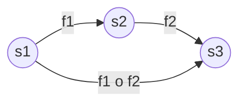
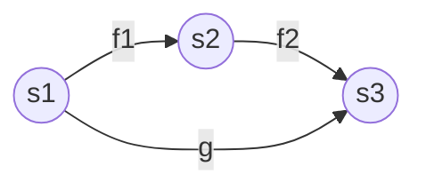
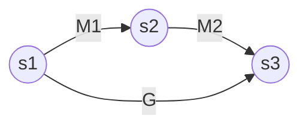

# 从函数角度去看矩阵

考虑矩阵运算本质上很困难，我们期望寻找一个简单的思考逻辑而不是反复纠结矩阵每一项的具体意义。我们可以从函数的角度去看矩阵，这样可以让我们更简单理解矩阵的运算。

## 矩阵和函数映射 Matrix and Function

我们知道对于函数 $f$，其可以将一个输入空间映射到一个输出空间，如 $f: \mathcal{X} \mapsto \mathcal{Y}$，如果输入空间为 $m$ 维的实数空间 $\mathbb{R}^m$（即输入是 $m$ 个实数），输出空间为 $n$ 维的实数空间 $\mathbb{R}^n$（输出是 $n$ 个实数），则可以表示为，则其可以用如下标记表示：

$$
f : \mathbb{R}^m \mapsto \mathbb{R}^{n}
$$

也可以使用 **笛卡尔积（Cartesian product）** 表示：
$$
f: m \times n
$$
让我们再考虑一个 $m$ 行 $n$ 列的矩阵 $\mathbf{M}$，其的表示形式为：
$$
\mathbf{M}_{m\times n}
$$

> **矩阵的形状**  
> 对于 $m$ 行 $n$ 列 的矩阵，其形状为 $(m\times n)$，类似的，我们可以认为 $d$ 维向量是一个 $d \times 1$ 形状的矩阵。

我们发现矩阵的形状表示和函数的笛卡尔积非常类似（$(m\times n)$ vs. $m\times n$），表示其中必然有相似联系。

我们可以将 $n$ 个实数（$\mathbb{R}^n$）看作一个 $n \times 1$ 的矩阵，即一个 $n$ 维的向量 $\mathbf{v}_{n\times 1}$。如果将这个向量分别作用在函数 $f$ 和矩阵 $\mathbf{M}$ 上，我们会发现一个有趣的性质：

$$
\begin{align*}
f(\mathbf{v}) &\mapsto \mathbb{R}^m\\
\mathbf{M}_{m\times n} \mathbf{v}_{n\times 1} &\mapsto \mathbf{u}_{m\times 1}
\end{align*}
$$

对于 $f$ 函数和 $\mathbf{M}$ 矩阵都能右接受一个 $n$ 维的数字，然后将其映射到一个 $m$ 维的数字。

换句话说，我们可以认为**矩阵运算和函数运算非常类似。其都是将输入空间映射到对应的输出空间。** 即其都在将输入空间变换到输出空间。

## 组合 Composition

如果我们再考虑组合，即考虑一个函数 $g : l \times m$，其与函数 $f : m \times n$ 的 composition 可以被描述为
$$
g \circ f : (l \times m)\circ (m \times n) \Longrightarrow g \circ f : l\times n
$$

> 组合运算为：
> $$
> g \circ f (x) = g(f(x))
> $$

而我们再考虑矩阵，假设矩阵 $L_{l \times m}, M_{m \times n}$，则有
$$
L \cdot M : (l \times m) \cdot (m\times n) \Longrightarrow L \cdot M : l\times n
$$
即，我们发现矩阵点乘也类似于函数的组合。

## 逆运算 Inverse

如考虑点 $s_1$ 可以通过函数 $f_1$ 映射到 $s_2$，$s_3$ 可以通过 $s_2$ 通过函数 $f_2$ 映射。

$$
s_1 \xrightarrow[]{f_1} s_2 \xrightarrow[]{f_2} s_3
$$

即

如令 $f_1, f_2$ 的组合为 $g = f_1\circ g_2$，则有
$$
s_2 = f_1 (s_1)\qquad s_3 = f_2(s_2) \quad
s_3 = \underbrace{f_2 \circ f_1}_{g} (s_1)\\
s_3 = g (s_1)\\
$$

如果矩阵 $M_1, M_2$ 可以分别表示 $f_1, f_2$，则可以写作：

$$
s_2 = \mathbf{M}_1 s_1
\qquad
s_3 = \mathbf{M}_2 s_2
\qquad
s_3 = \underbrace{\mathbf{M}_2\mathbf{M}_1}_{\mathbf{G}} s_1
\\
s_3 = \mathbf{G} s_1\\
$$

而如果考虑逆运算，即

$$
s_1 = f_1^{-1} (s_2)\qquad s_2 = f_2^{-1}(s_3)
\qquad
s_1 = \underbrace{f_1^{-1} \circ f_2^{-1}}_{g^{-1}} (s_3)\\
s_1 = g^{-1}(s_3)\\
$$

类似的，矩阵可以写作

$$
s_1 = \mathbf{M}_1^{-1} s_2\qquad s_2 = \mathbf{M}_2^{-1}s_3
\qquad
s_1 = \underbrace{\mathbf{M}_1^{-1} \mathbf{M}_2^{-1}}_{\mathbf{G^{-1}}} s_3
\\
s_1 = \mathbf{G^{-1}} s_3
$$

因此我们获得了矩阵的逆运算规则：

$$
\mathbf{G^{-1}} = (\mathbf{M}_2\mathbf{M}_1)^{-1} = \mathbf{M}_1^{-1} \mathbf{M}_2^{-1}
$$
而如果矩阵 $\mathbf{P}_{m\times n}$ 不是方阵（Square Matrix），则其并没有严格意义上的 Inverse，即 $\mathbf{P}^{-1}$，我们可以引入 Pseudo Inverse (Moore–Penrose inverse)  $\mathbf{P}^+$ 来表示 $\mathbf{P}$ 的逆：
$$
\mathbf{P}^+_{n\times m} = \underbrace{\mathbf{P}^T}_{n\times m}\underbrace{(\overbrace{\mathbf{P}\mathbf{P}^T}^{(m\times n)\cdot (n\times m)})^{-1}}_{m\times m}
$$
 $\mathbf{P}^+$ 满足一个逆的定义
$$
\mathbf{P}_{m\times n} \mathbf{P}^+_{n\times m} = \mathbf{I}_{m\times m}\\
\mathbf{P}^+_{n\times m}\mathbf{P}_{m\times n}  = \mathbf{I}_{n\times n}
$$

> **⚠️注意**：这两个性质并不总是同时成立。实际上，对于非方阵的伪逆，只有在以下情况下才成立：
>
> 如果 $m < n$ 且 $\mathbf{P}$ 是行满秩的，则只有第一个等式成立
> 如果 $m < n$ 且 $\mathbf{P}$ 是列满秩的，则只有第二个等式成立
> 只有当 $m = n$ 且 $\mathbf{P}$ 是满秩方阵时，两个等式才同时成立

## 总结

在函数空间和向量空间，我们有如下对应关系

| 运算 | 函数空间                                    |  向量空间 |
| :---: | :-----------------------------------------: | :----------------: |
| 映射/变换 | $f: \mathbb{R}^m \to\mathbb{R}^n$ 或 $f: m\times n$         | $\mathbf{F}_{m\times n}$                                     |
| 组合 | $g \circ f$                                 | $\mathbf{G}\cdot \mathbf{F}$                                 |
| 逆运算 | $f^{-1}$                                    | $\mathbf{F}^{-1}$ 或 $\mathbf{F}^+$                   |
| 组合逆运算 | $(f_1 \circ f_2) = f_1^{-1} \circ f_2^{-1}$ | $(\mathbf{M}_2\mathbf{M}_1)^{-1} = \mathbf{M}_1^{-1} \mathbf{M}_2^{-1}$ |

我们可以把矩阵看作一个函数映射，这样的好处是你不再需要关注矩阵具体在做什么，而只需要映射这件事的**语义（semantic）**以及**输入和输出空间的形状**即可。

例如，如果我们需要求一个矩阵，其可以将红绿蓝三色的光值（3 维向量，分别代表红绿蓝的值）转换为灰度值（1 个标量，也可以看作 $1\times 1$ 的矩阵）。从空间视角，我们期望能寻找到函数能够将 3 维三色空间中的点映射到 1 维灰度空间。那其实意味着我们需要找一个形状为 $1\times 3$ 的矩阵 $T$（如果左结合则为 $3\times 1$），其满足对应转换即可。很多时候，我们只在乎矩阵中的语义（做了什么），而不需要在乎里面在进行什么计算（怎么做）。

当然，需要注意的矩阵能表达的映射是有限的，而函数则可以表达更多的映射关系。因此，矩阵看作是函数的一种特殊形式。