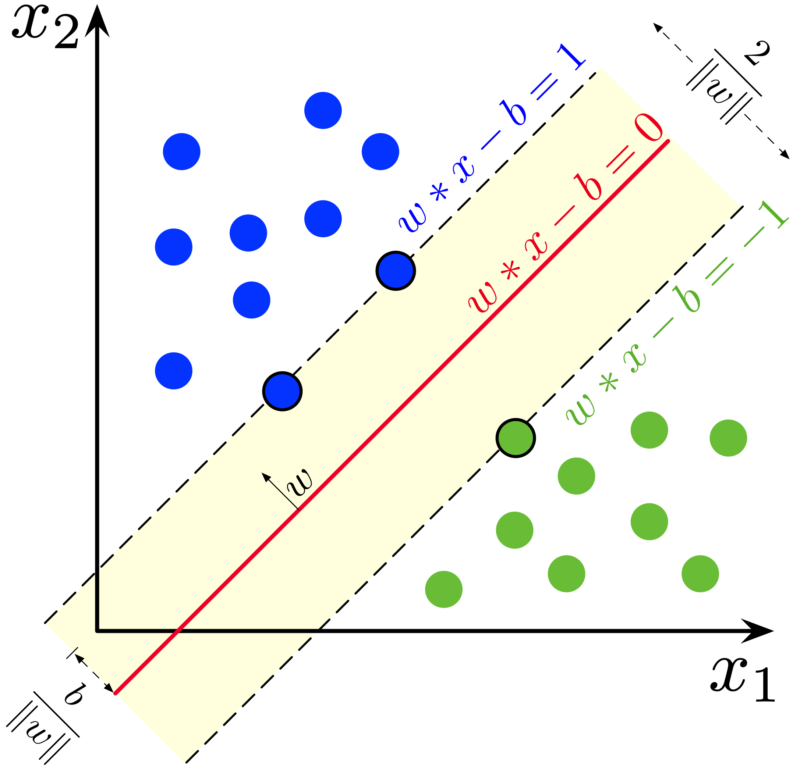

# 支持向量机 Support Vector Machine


```admonish warning title="难度提醒"
这一节内容非常复杂。需要你有足够的耐心和一定的数学功底。第一遍阅读可以略读或跳过这一节。
```

支持向量机（Support Vector Machine, SVM）是一种二分类模型，其基本模型是定义在特征空间上的间隔最大的线性分类器，其学习策略便是间隔最大化。SVM 通过间隔最大化，可以使得模型对噪声更加鲁棒，从而提高模型的泛化能力。


和逻辑回归一样，支持向量机是一个二分类模型，且其也是个线性模型，即其分割超平面为 $\mathbf{w}^T\mathbf{x}+b=0$。我们可以将数据集分为两类，一类为正类，一类为负类。

```admonish info title="什么是线性可分？"
**线性可分**是指存在一个（超）平面可以将数据集完全分割开，即正类在（超）平面的一侧，负类在（超）平面的另一侧。
```

在下面我们将首先讨论线性可分情况下的支持向量机。再介绍线性不可分的情况。

## 基础想法


我们考虑分类算法，我们只是关注是否所有的数据点被正确分类了，而并不在乎我们到底选择了哪一个（超）平面用于用于分隔数据点。但是支持向量机不仅仅关注分类是否正确，还关注分类的边界。我们希望分类的边界尽可能远离数据点，这样可以使得模型对噪声更加鲁棒，从而提高模型的泛化能力。



[https://en.m.wikipedia.org/wiki/File:SVM_margin.png]

上图是 SVM 的示例图。红色线是我们的假说。蓝色点为正类，绿色点为负类。黄色区域则是由离假说最近的正类和负类点组成的**间隔（Margin）**。间隔线（虚线）与假说平行，而在间隔线上的数据点，我们称其为**支持向量（Support Vector）**。我们希望寻找一个假说可以将两个类被正确分开，且能够使这个间隔最大化。

而因此，我们定义了新的假说：

$$
\begin{equation}
h(\mathbf{x})=\left\{
\begin{aligned}
+1 \quad&\text{ if }\mathbf{w}^T\mathbf{x}+b>0 \\
-1 \quad&\text{ if }\mathbf{w}^T\mathbf{x}+b<0
\end{aligned}
\right.
\end{equation}
$$

即，如果这个点在超平面的上侧，我们将其分类为正类，否则分类为负类。


## 点到平面的距离

在一切开始前，我需要先介绍一下点到（超）平面（后简称平面）的距离。

我们定义平面 $H$ 为 $\mathbf{w}^T\mathbf{x}+b=0$。
并定义点 $Q$ $(q_1, q_2, q_3,..., q_N)$ 到平面 $H$ 的距禽为 $\text{dist}(Q, H)$。

我们想要知道怎么计算点 $Q$ 到平面 $H$ 的距离。

取平面任意一点 $P$ $(p_1, p_2, p_3,..., p_N)$，且因为平面上的点满足 $\mathbf{w}^T\mathbf{x}+b=0$，因此有 $\mathbf{w}^T\mathbf{p}+b=0$。

向量 $\overrightarrow{PQ} = \mathbf{q} - \mathbf{p}$，其相对于平面法向量的投影为 $| \overrightarrow{PQ}|\cos \theta$，其中 $\theta$ 为 $\overrightarrow{PQ}$ 和 $\mathbf{w}$ 的夹角。考虑其投影的几何性质，我们可以得到 $\text{dist}(Q, H) = | \overrightarrow{PQ}|\cos \theta$。

令法向量 $\mathbf{n}\perp H: (w_1, w_2, ..., w_n)$，有


$$
\begin{align}
\overrightarrow{PQ}\cdot \mathbf{n} &= |\overrightarrow{PQ}||\mathbf{n}|\cos \theta\\

|\overrightarrow{PQ}|\cos \theta &= \frac{\mathbf{n}}{|\mathbf{n}|} \cdot \overrightarrow{PQ} \\
\end{align}
$$

因此则有：

$$
\begin{align}
\text{dist}(Q, H) &= \frac{\mathbf{n}}{|\mathbf{n}|} \cdot \overrightarrow{PQ} \\
&= \frac{\mathbf{w}}{||\mathbf{w}||} \cdot (\mathbf{q} - \mathbf{p})\\
&= \frac{1}{||\mathbf{w}||} \cdot (\mathbf{w}^T\mathbf{q} - \mathbf{w}^T\mathbf{p})\\
&= \frac{1}{||\mathbf{w}||} \cdot (\mathbf{w}^T\mathbf{q} + b - (\mathbf{w}^T\mathbf{p}+b))\\
\because \quad& \mathbf{w}^T\mathbf{p}+b=0\\
\therefore \quad \text{dist}(Q, H) &= \frac{1}{||\mathbf{w}||} \cdot (\mathbf{w}^T\mathbf{q} + b)\\
&= \frac{\mathbf{w}^T\mathbf{q} + b}{||\mathbf{w}||}

\end{align}
$$


## 定义间隔（Margin）


根据上一节，我们可以定义距离公式：

$$
\begin{align}
&\text{dist}(h, \mathbf{x}_i) = \frac{\mid h(\mathbf{x}_i) \mid}{||\mathbf{w}||}\\
\end{align}
$$

我们定义距离

$$
\begin{align}
d_i &= \text{dist}(h, \mathbf{x}_i) \\
&=\frac{\mid h(\mathbf{x}_i) \mid}{||\mathbf{w}||}
\end{align}
$$

考虑 $y\in\{-1, +1\}$，因此由：

$$
\begin{equation}
y_i=\left\{
\begin{aligned}
+1 \quad&\text{ if }\mathbf{w}^T\mathbf{x}_i + b>0 \quad \text{分类正确}\\
-1 \quad&\text{ if }\mathbf{w}^T\mathbf{x}_i + b<0 \quad \text{分类正确}\\
+1 \quad&\text{ if }\mathbf{w}^T\mathbf{x}_i + b\leq0 \quad \text{分类错误} \\
-1 \quad&\text{ if }\mathbf{w}^T\mathbf{x}_i + b\geq0 \quad \text{分类错误}
\end{aligned}
\right.
\end{equation}
$$

即如果分类正确，$y_i(\mathbf{w}^T\mathbf{x}_i+b)>0$，如果分类错误，$y_i(\mathbf{w}^T\mathbf{x}_i +b )\leq0$。考虑 $y_i \in \{ +1, -1\}$，即乘上它只会改变 $\mathbf{w}^T\mathbf{x}_i + b$ 的正负号而不会改变其绝对值，因此如果所有点都被正确分类，我们可以把边距改写为

$$
\begin{align}

d_i
=\frac{\mid h(\mathbf{x}_i) \mid}{||\mathbf{w}||}
&=\frac{y_i(\mathbf{w}^T\mathbf{x}_i+b)}{||\mathbf{w}||}
\\
&\Downarrow\\
d_i &=\frac{y_i(\mathbf{w}^T\mathbf{x}_i+b)}{||\mathbf{w}||}\\
s.t. \quad \forall & (\mathbf{x}_i, y_i)\in \mathcal{D}.\quad y_i h(\mathbf{x}_i)>0
\end{align}
$$

经过此变换，我们可以得到一个更加简洁的表达式：

$$
\begin{align}
& d_i =\frac{y_i(\mathbf{w}^T\mathbf{x}_i+b)}{||\mathbf{w}||}\\
s.t. \quad &\forall (\mathbf{x}_i, y_i)\in \mathcal{D}.\quad y_i h(\mathbf{x}_i)>0
\end{align}
$$

## 定义原问题 Prime Problem

我们的目标是最大化最小的间隔，即我们要先找到最小的间隔 $\gamma_n = \min _n d_n$，然后寻找使其最大的参数 $\mathbf{w}$ 和 $b$。因此我们可以定义原问题为：

$$
\begin{align}
& \argmax_{\mathbf{w}, b}\{\min_n d_n\}\\
\text{where}\quad
&d_n = \frac{y_n(\mathbf{w}^T\mathbf{x}_n+b)}{||\mathbf{w}||}\\
s.t. \quad
&\forall (\mathbf{x}_i, y_i)\in \mathcal{D}.\quad y_i h(\mathbf{x}_i)>0
\end{align}
$$

即

$$
\begin{align}
& \argmax_{\mathbf{w}, b}\left\{\min_n \frac{y_n(\mathbf{w}^T\mathbf{x}_n+b)}{||\mathbf{w}||}\right\}\\
s.t. 
\quad& \forall (\mathbf{x}_i, y_i)\in \mathcal{D}.\quad y_i h(\mathbf{x}_i)>0
\end{align}
$$

由于在求最小点的时候，我们固定了 $\mathbf{w}$ ，因此我们可以把 $\mathbf{w}$ 提出来，即

$$
\begin{align}
& \argmax_{\mathbf{w}, b}\left\{ \frac{1}{{||\mathbf{w}||}}  \min_n y_n(\mathbf{w}^T\mathbf{x}_i+b) \right\}\\
s.t.
\quad& \forall (\mathbf{x}_i, y_i)\in \mathcal{D}.\quad y_i h(\mathbf{x}_i)>0
\end{align}
$$

考虑如果存在 $\mathbf{w}$ 和 $b$ 能满足超平面。则超平面可以被定义为

$$
\begin{align}
\mathbf{w}^T\mathbf{x}+b=0
\end{align}
$$

如果我们对 $\mathbf{w}$ 和 $b$ 进行缩放，即 $\mathbf{w}\Rightarrow k\mathbf{w}$，$b\Rightarrow kb$，这样我们可以得到

$$
\begin{align}
(k\mathbf{w})^T\mathbf{x}+kb&=0\\
k(\mathbf{w}^T\mathbf{x}+b)&=0
\end{align}
$$

如果我们考虑最小边距的点，即 $\min_n y_n(\mathbf{w}^T\mathbf{x}_n+b)$，考虑总是存在常量 $k$ 使得$\min_n y_n(k\mathbf{w}^T\mathbf{x}_n+kb) = 1$，因此我们可以对平面进行乘 $k$变换，因此有 $\min_n y_n(\mathbf{w}^T\mathbf{x}_n+b) = 1$。而由于最小化的边距被定义为了 $1$，因此约束条件被改写为
$$
\begin{align}
s.t.
\quad& \forall (\mathbf{x}_i, y_i)\in \mathcal{D}.\quad y_i h(\mathbf{x}_i)\geq 1
\end{align}
$$


因此我们可以改写原问题为

$$
\begin{align}
& \argmax_{\mathbf{w}, b}\left\{ \frac{1}{{||\mathbf{w}||}}  \right\}\\
s.t.
\quad& \forall (\mathbf{x}_i, y_i)\in \mathcal{D}.\quad y_i h(\mathbf{x}_i)\geq 1
\end{align}
$$

边界 $\gamma$ 被定义为
$$
\gamma=\frac{1}{||\mathbf{w}||}
$$
而最大化一个数的倒数等价于最小化这个数的倒数的倒数，即
$$
\begin{align}
& \argmin_{\mathbf{w}, b}\left\{||\mathbf{w}|| \right\}\\
s.t. 
\quad& \forall (\mathbf{x}_i, y_i)\in \mathcal{D}.\quad y_i h(\mathbf{x}_i)\geq 1
\end{align}
$$

考虑我们最小化一个绝对值，也就在最小化这个绝对值的平方，因此有：

$$
\begin{align}
& \argmin_{\mathbf{w}, b}\left\{||\mathbf{w}||^2\right\}\\
s.t. 
\quad& \forall (\mathbf{x}_i, y_i)\in \mathcal{D}.\quad y_i h(\mathbf{x}_i)\geq 1
\end{align}
$$

为了方便之后的求导，我们可以把最小化的平方乘上一个正系数 $\frac{1}{2}$，即：

$$
\begin{align}
& \argmin_{\mathbf{w}, b}\left\{\frac{1}{2}|| \mathbf{w} ||^2\right\}\\
s.t. 
\quad& \forall (\mathbf{x}_i, y_i)\in \mathcal{D}.\quad y_i h(\mathbf{x}_i)>0
\end{align}
$$

我们对 $\mathbf{x}$ 进行非线性变换，即 $\mathbf{x}\Rightarrow \phi(\mathbf{x})$，这样我们可以得到


$$
\begin{align}

& \argmin_{\mathbf{w}, b}\left\{\frac{1}{2}|| \mathbf{w} ||^2\right\}\\
s.t. \quad& 
\forall (\mathbf{x}_i, y_i)\in \mathcal{D}.\\
&y_i(\mathbf{w}^T\phi(\mathbf{x}_i)+b)\geq1
\end{align}
$$

我们需要优化这个函数

## 改写为对偶问题 Dual Problem

考虑原问题

$$
\begin{align}

& \argmin_{\mathbf{w}, b}\left\{\frac{1}{2}|| \mathbf{w} ||^2\right\}\\
s.t. \quad& 
\forall (\mathbf{x}_i, y_i)\in \mathcal{D}.\\
&y_i(\mathbf{w}^T\phi(\mathbf{x}_i)+b)\geq1
\end{align}
$$

由于约束比较复杂，我们难以直接优化。因此我们需要改写原问题以方便优化。


我们可以定义一个惩罚函数 $g(\mathbf{w}, b)$，当违反约束时，这个惩罚会很大，而当满足约束时，这个惩罚会很小。因此在优化这个整体问题时，我们也在优化惩罚函数，即尽可能符合约束。即我们可以定义把原问题重新写为：

$$
\begin{align}
& \argmin_{\mathbf{w}, b}\left\{\frac{1}{2}|| \mathbf{w} ||^2 + g(\mathbf{w}, b)\right\}
\end{align}
$$
如果我们能将约束转化为上述的 $g$ 函数，则我们就可以把原问题转化为一个无约束问题。因此我们需要构建惩罚函数 $g$。

### 惩罚函数

我们首先改写约束条件：

$$
\begin{align}
y_i(\mathbf{w}^T\phi(\mathbf{x}_i)+b)&\geq1\\
&\Downarrow\\
y_i(\mathbf{w}^T\phi(\mathbf{x}_i)+b)-1&\geq0\\
&\Downarrow\\
1-y_i(\mathbf{w}^T\phi(\mathbf{x}_i)+b)&\leq0
\end{align}
$$


我们可以定义惩罚函数为

$$
\begin{align}
& g(\mathbf{w}, b) = \sum_{i=1}^N \alpha_i(1-y_i(\mathbf{w}^T\phi(\mathbf{x}_i)+b))\\
s.t. \quad& \alpha_i \geq 0
\end{align}
$$

在这里，我们称 $\alpha_i$ 为拉格朗日乘子。（因为这个方法本质上被称为拉格朗日乘子法）且其：

1. 当 $\mathbf{x}_i$ 不是支持向量，即 $\alpha_i = 0$，这个点对于最终的分类没有影响
2. 当 $\mathbf{x}_i$ 是支持向量，即 $\alpha_i > 0$，这个点对于最终的分类有影响

当 $\alpha_i > 0$ 时，我们称 $\mathbf{x}_i$ 为支持向量。需要注意的是尽管有可能 $\mathbf{x}_i$ 在边界上，但是其 $\alpha_i$ 仍然可能为 $0$。

我们希望使得所有违反约束的点的惩罚尽可能大，即我们希望最大化这些惩罚，因此我们可以改写惩罚函数为：

$$
\begin{align}
& g(\mathbf{w}, b) = \max \sum_{i=1}^N \alpha_i(1-y_i(\mathbf{w}^T\phi(\mathbf{x}_i)+b))\\
s.t. \quad& \alpha_i \geq 0
\end{align}
$$

我们将惩罚函数带入原问题，我们可以得到：

$$
\begin{align}
&\argmin_{\mathbf{w}, b}\left\{\frac{1}{2}|| \mathbf{w} ||^2+
\max_\alpha\sum_{n=1}^N\alpha_n(1-y_n(\mathbf{w}^T\phi(\mathbf{x}_n)+b))
\right\}\\
s.t. \quad
&y_n(\mathbf{w}^T\phi(\mathbf{x}_n)+b)\geq1\\
&\alpha_n\geq0
\end{align}
$$

由于内侧优化 $\max_\alpha$ 并不会影响到 $\frac{1}{2}|| \mathbf{w} ||^2$，因此可以提出来，即：
$$
\begin{align}
&\min_{\mathbf{w}, b} \max_\alpha\left\{\frac{1}{2}|| \mathbf{w} ||^2+
\sum_{n=1}^N\alpha_n(1-y_n(\mathbf{w}^T\phi(\mathbf{x}_n)+b))
\right\}\\
s.t. \quad
&y_n(\mathbf{w}^T\phi(\mathbf{x}_n)+b)\geq1\\
&\alpha_n\geq0
\end{align}
$$

根据一些数学推导，我们可以得到最终的优化问题为：

$$
\begin{align}
&\max_\alpha\min_{\mathbf{w}, b} \left\{\frac{1}{2}|| \mathbf{w} ||^2+
\sum_{n=1}^N\alpha_n(1-y_n(\mathbf{w}^T\phi(\mathbf{x}_n)+b))
\right\}\\
s.t. \quad
&y_n(\mathbf{w}^T\phi(\mathbf{x}_n)+b)\geq1\\
&\alpha_n\geq0
\end{align}
$$

```admonish note title=""
我们将省略上侧这一步的推导，简单来说我们可以将优化看成两部分：

- 最小化 $\frac{1}{2}|| \mathbf{w} ||^2$
- 最大化 $\sum_{n=1}^N\alpha_n(1-y_n(\mathbf{w}^T\phi(\mathbf{x}_n)+b))$

前者可以被轻易证明是凸的（convex），因此其的极小值为全局最小值。
而后者也可以被证明为凹的（concave）。因此其的极大值为全局最大值。  

由 Minimax 定理，在此情况下的 $\max \min$ 是可以进行交换优化的。
```

```admonish info title="Minimax 定理"
对于固定的 $y$，有 $f(\cdot, y): X \to \mathbb{R}$ 是 concave，且  
对于固定的 $x$，有 $f(x, \cdot): Y \to \mathbb{R}$ 是 convex。

则我们有

$$
\max_{x\in X}\min_{y\in Y}f(x, y) = \min_{y\in Y}\max_{x\in X}f(x, y)
$$

具体请参考 [Minimax Theorem - Wikipedia](https://en.wikipedia.org/wiki/Minimax_theorem)
```

即：
$$
\begin{align}
&\max_\alpha\min_{\mathbf{w}, b}
\mathcal{L}(\alpha, \mathbf{w}, b)=
\left\{\frac{1}{2}|| \mathbf{w} ||^2+
\sum_{n=1}^N\alpha_n(1-y_n(\mathbf{w}^T\phi(\mathbf{x}_n)+b))
\right\}\\
s.t. \quad
&y_n(\mathbf{w}^T\phi(\mathbf{x}_n)+b)\geq1\\
&\alpha_n\geq0
\end{align}
$$

### 求解对偶问题

我们对其进行求导，即

$$
\begin{align}
\frac{\partial \mathcal{L}}{\partial \mathbf{w}} &= \mathbf{w} - \sum_{n=1}^N \alpha_n y_n \phi(\mathbf{x}_n) \\
\frac{\partial \mathcal{L}}{\partial b} &= -\sum_{n=1}^N \alpha_n y_n\\
\end{align}
$$

如果损失最小，我们可以得到：

$$
\begin{matrix}
\frac{\partial \mathcal{L}}{\partial \mathbf{w}} = 0&\Rightarrow&\mathbf{w} = \sum_{n=1}^N \alpha_n y_n \phi(\mathbf{x}_n)\\

\\

\frac{\partial \mathcal{L}}{\partial b} = 0 &\Rightarrow& \sum_{n=1}^N \alpha_n y_n = 0
\end{matrix}
$$

将 $\mathbf{w}$ 和 $b$ 代入 $\mathcal{L}$，我们可以把优化问题改写为

$$
\begin{align}
&\argmax_\alpha \mathcal{L}(\alpha)=\sum^N_{n=1}\alpha_n-
\frac{1}{2}\sum^N_{n=1}\sum^N_{m=1}
\alpha_n\alpha_my_ny_m\phi(\mathbf{x}_n)^T\phi(\mathbf{x}_m)\\

s.t.\quad
&\alpha_n\geq 0\\
&\sum^N_{n=1}a_ny_n=0
\end{align}
$$

定义核函数 $\kappa(\mathbf{x}_n, \mathbf{x}_m)=\phi(\mathbf{x}_n)^T\phi(\mathbf{x}_m)$，可以把优化问题改写为

$$
\begin{align}
&\argmax_\alpha \mathcal{L}(\alpha)=\sum^N_{n=1}\alpha_n-
\frac{1}{2}\sum^N_{n=1}\sum^N_{m=1}
\alpha_n\alpha_my_ny_m\kappa(\mathbf{x}_n, \mathbf{x}_m)\\

s.t.\quad
&\alpha_n\geq 0\\
&\sum^N_{n=1}a_ny_n=0\\
\text{where}\quad
&\kappa(\mathbf{x}_n, \mathbf{x}_m)=\phi(\mathbf{x}_n)^T\phi(\mathbf{x}_m)
\end{align}
$$

## 预测

原问题的预测是很直觉的，即：

$$
\begin{align}
\text{predict}_{prime}(\mathbf{x})&=\text{sign}(h(\mathbf{x}))\\
&=\text{sign}(\mathbf{w}^T\phi(\mathbf{x})+b)\\
&=\text{sign}\left(\sum_{n=1}^N \alpha_n y_n \kappa(\mathbf{x}_n, \mathbf{x})+b\right)
\end{align}
$$

其中 $\text{sign}$ 为符号函数，即如果输入为正数，则输出为 $+1$，否则输出为 $-1$。

而对偶问题的预测有所不同。由于我们有 $\mathbf{w} = \sum_{n=1}^N \alpha_n y_n \phi(\mathbf{x}_n)$，我们将其带入 $h(\mathbf{x})$，我们可以得到：

$$
\begin{align}
h(\mathbf{x})&=\mathbf{w}^T\phi(\mathbf{x})+b\\
&=\left(\sum_{n=1}^N \alpha_n y_n \phi(\mathbf{x}_n)\right)^T\phi(\mathbf{x})+b\\
&=\sum_{n=1}^N \alpha_n y_n \phi(\mathbf{x}_n)^T\phi(\mathbf{x})+b\\
&=\sum_{n=1}^N \alpha_n y_n \kappa(\mathbf{x}_n, \mathbf{x})+b
\end{align}
$$

$$
\begin{align}
\text{predict}_{dual}(\mathbf{x})&=\text{sign}(h(\mathbf{x}))\\
&=\text{sign}\left(\sum_{n=1}^N \alpha_n y_n \kappa(\mathbf{x}_n, \mathbf{x})+b\right)
\end{align}
$$


## 软间隔 Soft Margin

但是如果遇到非线性可分情况，我们需要引入软间隔（Soft Margin）。我们可以引入一个松弛变量 $\xi_n$，其可以使得一些点可以在越过边界的情况下被正确分类。我们可以定义新的约束条件：

$$
\begin{align}
\forall \quad &n\in\{1, 2, ..., N\}.\\
&y_n(\mathbf{w}^T\phi(\mathbf{x}_n)+b)\geq1-\xi_n\\
&\xi_n\geq0
\end{align}
$$

即

$$
\begin{align}
\forall \quad & n \in [1, N].\\
&y_n(\mathbf{w}^T\phi(\mathbf{x}_n)+b)+\xi_n\geq1 \quad (\xi_n\geq0)\\
\end{align}
$$

而其实我们本质期望这个松弛变量 $\xi_n$ 越小越好，因此我们可以定义惩罚函数 $g_{\xi}$ 为：

$$
\begin{align}
g_{\xi}=C\sum_{n=1}^N\xi_n
\end{align}
$$

其中 $C$ 为一个超参数（hyperparameter），其可以控制惩罚的大小。我们可以把原问题改写为：

$$
\begin{align}
&\argmin_{\mathbf{w}, b, \xi}\left\{\frac{1}{2}|| \mathbf{w} ||^2+C\sum_{n=1}^N\xi_n\right\}\\
s.t. \quad
&\forall n\in[1, N].\\
&y_n(\mathbf{w}^T\phi(\mathbf{x}_n)+b)+\xi_n\geq1\\
&\xi_n\geq0
\end{align}
$$

```admonish note title="什么是超参数"
超参数是在开始学习过程之前设置的参数，其控制或影响学习的过程。在学习过程中，超参数是固定的，不会被学习和改变。超参数的选择是非常重要的，不同的超参数会导致不同的学习效果。
```

我们可以将问题逐步改写为对偶问题以方便求解：

$$
\begin{align}
&\argmin_{\mathbf{w}, b, \xi}\left\{\frac{1}{2}|| \mathbf{w} ||^2+C\sum_{n=1}^N\xi_n\right\}\\
s.t. \quad
&\forall n\in[1, N].\\
&1 - \xi_n - y_n(\mathbf{w}^T\phi(\mathbf{x}_n)+b)\leq 0\\
&-\xi_n\leq0
\end{align}
$$

改写为拉格朗日乘子法为：


$$
\begin{align}
\mathcal{L} &= \frac{1}{2}|| \mathbf{w} ||^2+C\sum_{n=1}^N\xi_n
- \sum_{n=1}^N\beta_n\xi_n + \sum_{n=1}^N\alpha_n[1 - \xi_n - y_n(\mathbf{w}^T\phi(\mathbf{x}_n)+b)]
\\
\text{where}\quad & \alpha_n \geq 0\\
& \beta_n\geq 0
\end{align}
$$
和线性可分情况类似（即没有软间隔的情况，也被称为硬间隔），我们的优化问题因此被转化为：
$$
\begin{align}
&\max_\alpha \min_{\mathbf{w}, b} \mathcal{L}   & & \min_{\mathbf{w}, b}\max_\alpha  \mathcal{L}
\\
\text{where}\quad & \alpha_n \geq 0 & \text{where}  \quad& \alpha_n \geq 0\\
& \beta_n\geq 0 &  & \beta_n\geq 0\\
& y_n(\mathbf{w}^T\mathbf{x}_n)\geq 1 + \xi_n & & y_n(\mathbf{w}^T\mathbf{x}_n)\geq 1+ \xi_n
\end{align}
$$
上述两个问题是等价的（Minimax Theorem）。


而如果我们对此拉格朗日乘子法取最低点，即为
$$
\begin{matrix}
\frac{\partial \mathcal{L}}{\partial \mathbf{w}} = 0
&\Rightarrow&
\mathbf{w} - \sum_{n=1}^N \alpha_n y_n \phi(\mathbf{x}_n) = 0
&\Rightarrow&
\mathbf{w} = \sum_{n=1}^N \alpha_n y_n \phi(\mathbf{x}_n)
\\

\frac{\partial \mathcal{L}}{\partial \xi_n} = 0
&\Rightarrow&
C-\beta_n-\alpha_n = 0
&\Rightarrow&
\alpha_n+\beta_n=C
\\


\frac{\partial \mathcal{L}}{\partial b} = 0
&\Rightarrow&
-\sum_{n=1}^N \alpha_n y_n = 0
&\Rightarrow&
\sum_{n=1}^N \alpha_n y_n = 0
\end{matrix}
$$


其中 $\alpha_n+\beta_n=C$ 可以改写为 $\alpha_n=C-\beta_n$，考虑 $\beta_n \geq 0$

因此则有 $\alpha_n\in[0, C]$。我们称这一条限制为 **Box Constraint**。

$$
\begin{align}
\mathcal{L} &= \frac{1}{2}|| \mathbf{w} ||^2+C\sum_{n=1}^N\xi_n
- \sum_{n=1}^N\beta_n\xi_n + \sum_{n=1}^N\alpha_n[1 - \xi_n - y_n(\mathbf{w}^T\phi(\mathbf{x}_n)+b)]
\\
&=\frac{1}{2}|| \mathbf{w} ||^2+C\sum_{n=1}^N\xi_n
- \sum_{n=1}^N\beta_n\xi_n -\sum_{n=1}^N\alpha_n\xi_n + \sum_{n=1}^N\alpha_n[1 - y_n(\mathbf{w}^T\phi(\mathbf{x}_n)+b)]
\\
&=\frac{1}{2}|| \mathbf{w} ||^2+C\sum_{n=1}^N\xi_n
- \sum_{n=1}^N(\alpha_n+\beta_n)\xi_n+ \sum_{n=1}^N\alpha_n[1 - y_n(\mathbf{w}^T\phi(\mathbf{x}_n)+b)]
\\
\because & \quad \alpha_n+\beta_n=C
\\
\therefore &=\frac{1}{2}|| \mathbf{w} ||^2+C\sum_{n=1}^N\xi_n
- \sum_{n=1}^NC\xi_n+ \sum_{n=1}^N\alpha_n[1 - y_n(\mathbf{w}^T\phi(\mathbf{x}_n)+b)]
\\
&=\frac{1}{2}|| \mathbf{w} ||^2+ \sum_{n=1}^N\alpha_n[1 - y_n(\mathbf{w}^T\phi(\mathbf{x}_n)+b)]
\\
&=\frac{1}{2}|| \mathbf{w} ||^2+ \sum_{n=1}^N\alpha_n[1 - y_n(\mathbf{w}^T\phi(\mathbf{x}_n))-y_nb]
\\
&=\frac{1}{2}|| \mathbf{w} ||^2+
\sum_{n=1}^N\alpha_n[1 - y_n(\mathbf{w}^T\phi(\mathbf{x}_n))]
-\sum_{n=1}^N\alpha_ny_nb
\\
&=\frac{1}{2}|| \mathbf{w} ||^2+
\sum_{n=1}^N\alpha_n[1 - y_n(\mathbf{w}^T\phi(\mathbf{x}_n))]
-b\sum_{n=1}^N\alpha_ny_n
\\
\because&\quad \sum_{n=1}^N \alpha_n y_n = 0
\\
\therefore &=\frac{1}{2}|| \mathbf{w} ||^2+
\sum_{n=1}^N\alpha_n[1 - y_n(\mathbf{w}^T\phi(\mathbf{x}_n))]
\\
&=\frac{1}{2}|| \mathbf{w} ||^2+
\sum_{n=1}^N\alpha_n-\sum_{n=1}^N \alpha_n y_n\mathbf{w}^T\phi(\mathbf{x}_n)
\end{align}
$$

因此这个公式可以被拆成三部分：

- $\frac{1}{2}|| \mathbf{w} ||^2$​
- $\sum_{n=1}^N\alpha_n$
- $-\sum_{n=1}^N \alpha_n y_n\mathbf{w}^T\phi(\mathbf{x}_n)$​

我们对第一项进行修改
$$
\begin{align}
 &\frac{1}{2}|| \mathbf{w} ||^2 = \frac{1}{2} \mathbf{w}^T\mathbf{w}
\\
\because \quad & \mathbf{w} = \sum_{n=1}^N \alpha_n y_n \phi(\mathbf{x}_n)
\\
\therefore \quad & \frac{1}{2}|| \mathbf{w} ||^2 = \frac{1}{2} 
\left( \sum_{i=1}^N \alpha_i y_i \phi(\mathbf{x}_i) \right)^T
\left( \sum_{j=1}^N \alpha_j y_j \phi(\mathbf{x}_j) \right)
\end{align}
$$

$$
\begin{align}
\frac{1}{2}|| \mathbf{w} ||^2 &= \frac{1}{2} 
\left( \sum_{i=1}^N \alpha_i y_i \phi(\mathbf{x}_i) \right)^T
\left( \sum_{j=1}^N \alpha_j y_j \phi(\mathbf{x}_j) \right)
\\
&= \frac{1}{2}\sum_{i=1}^N\sum_{j=1}^N\alpha_i\alpha_j y_i y_j \phi(\mathbf{x}_i)^T\phi(\mathbf{x}_j)
\\
&=\frac{1}{2}\sum_{i=1}^N\sum_{j=1}^N\alpha_i\alpha_j y_i y_j \kappa(\mathbf{x}_i,\mathbf{x}_j)

\end{align}
$$


我们对第三项进行修改
$$
\begin{align}
-\sum_{n=1}^N \alpha_n y_n\mathbf{w}^T\phi(\mathbf{x}_n)
&= -\sum_{n=1}^N \alpha_n y_n
\left( \sum_{j=1}^N \alpha_j y_j \phi(\mathbf{x}_j) \right)
^T\phi(\mathbf{x}_n)\\
&= -\sum_{i=1}^N \alpha_i y_i
\left( \sum_{j=1}^N \alpha_j y_j \phi(\mathbf{x}_j) \right)
^T\phi(\mathbf{x}_i)
\\
&= -\sum_{i=1}^N \alpha_i y_i
\left( \sum_{j=1}^N \alpha_j y_j \phi(\mathbf{x}_j)^T\phi(\mathbf{x}_i) \right)
\\
&= -\sum_{i=1}^N \alpha_i y_i
\left( \sum_{j=1}^N \alpha_j y_j \kappa(\mathbf{x}_j, \mathbf{x}_i) \right)
\\
&= -\sum_{i=1}^N\sum_{j=1}^N \alpha_i y_i
\alpha_j y_j \kappa(\mathbf{x}_j, \mathbf{x}_i)
\\
&= -\sum_{i=1}^N\sum_{j=1}^N \alpha_i \alpha_j y_i
y_j \kappa(\mathbf{x}_i, \mathbf{x}_j)
\end{align}
$$
将改写好的量带入：
$$
\begin{align}
\mathcal{L}&=\frac{1}{2}|| \mathbf{w} ||^2+
\sum_{n=1}^N\alpha_n-\sum_{n=1}^N \alpha_n y_n\mathbf{w}^T\phi(\mathbf{x}_n)
\\
&=
\frac{1}{2}\sum_{i=1}^N\sum_{j=1}^N\alpha_i\alpha_j y_i y_j \kappa(\mathbf{x}_i,\mathbf{x}_j)
+\sum_{n=1}^N\alpha_n
-\sum_{i=1}^N\sum_{j=1}^N \alpha_i \alpha_j y_i y_j \kappa(\mathbf{x}_i, \mathbf{x}_j)\\
&=\sum_{n=1}^N\alpha_n
-\frac{1}{2}\sum_{i=1}^N\sum_{j=1}^N\alpha_i\alpha_j y_i y_j \kappa(\mathbf{x}_i,\mathbf{x}_j)
\end{align}
$$
而我们的目标为最大化 $\mathcal{L}$，即
$$
\begin{align}
&\max_\alpha \mathcal{L}(\alpha)
\\
s.t.\quad & 0 \leq \alpha_i \leq C\\
& \sum_{i=1}^N\alpha_iy_i = 0
\end{align}
$$
更完整地


$$
\begin{align}
&\max_\alpha
\sum_{n=1}^N\alpha_n
-\frac{1}{2}\sum_{i=1}^N\sum_{j=1}^N\alpha_i\alpha_j y_i y_j \kappa(\mathbf{x}_i,\mathbf{x}_j)
\\
s.t.\quad & \alpha_i\in[0, C]\\
& \sum_{i=1}^N\alpha_iy_i = 0
\end{align}
$$


## SMO 算法

通过上述过程，我们获得了我们需要优化的问题：

$$
\begin{align}
&\max_\alpha
\sum_{n=1}^N\alpha_n
-\frac{1}{2}\sum_{i=1}^N\sum_{j=1}^N\alpha_i\alpha_j y_i y_j \kappa(\mathbf{x}_i,\mathbf{x}_j)
\\
s.t.\quad & \alpha_i\in[0, C]\\
& \sum_{i=1}^N\alpha_iy_i = 0
\end{align}
$$
相比于传统的直接使用梯度下降，SVM使用一个名为 SMO 算法。上述问题我们定义其为二次编程（QP）问题。SMO 是一个启发式算法，其将这个问题分解成很多子 QP 问题再逐个解决分析。其性能比直接梯度下降好很多。

我们的目标是通过选择 $\alpha$ 从而使这个问题最优化。

这个算法的核心想法是每一步，从 $\alpha$ 中选择两个 $\alpha_i$、$\alpha_j$ 并让其他 $\alpha$ 固定，然后调整这两个参数。通过反复循环这个操作，完成整体优化。

即：

**初始化** $\alpha$
循环：
	**选择**一对$\alpha_i$、$\alpha_j$
	保持其他 $\alpha$固定，**优化** $\alpha_i$ 和 $\alpha_j$

```admonish title="为什么不直接选择一个进行优化"
考虑是如果我们抽取一个 $\alpha_k$，而其仍需要满足约束 $\sum_{i=1}^N\alpha_iy_i = 0$，因此则有：
$$
\begin{align}
\alpha_ky_k+\sum_{i\in [0, N], i\neq k}\alpha_iy_i&=0
\\
\alpha_ky_k&= -\sum_{i\in [0, N], i\neq k}\alpha_iy_i
\\
\alpha_k &=-\frac{1}{y_k}\sum_{i\in [0, N], i\neq k}\alpha_iy_i
\end{align}
$$
而考虑 $y_k=\{-1, 1\} = \frac{1}{y_k}$，因此有
$$
\begin{align}
\alpha_k &=-\frac{1}{y_k}\sum_{i\in [0, N], i\neq k}\alpha_iy_i\\
&=-{y_k}\sum_{i\in [0, N], i\neq k}\alpha_iy_i
\end{align}
$$
而对于这种情况，调整 $\alpha_k$  是难以完成。

因此我们最少选择两个参数。
```

**选择** $\alpha$ ：最简单的做法是选择 $\alpha_i, \alpha_j\neq 0$ ，我们将在后面讨论具体应该怎么做

**优化** $\alpha$​ ：

由于我们固定了 $\alpha_i, \alpha_i$ 以外的所有参数，因此有


$$
\begin{align}
\sum_{n=1}^N\alpha_ny_n &= 0\\
\alpha_iy_i+\alpha_jy_j+\sum_{n\in[1, N]; n\neq i, j}\alpha_ny_n &=0\\
\alpha_iy_i+\alpha_jy_j &= -\sum_{n\in[1, N]; n\neq i, j}\alpha_ny_n
\end{align}
$$
如果令 $\zeta = -\sum_{n\in[1, N]; n\neq i, j}\alpha_ny_n$，则有：
$$
\alpha_iy_i+\alpha_jy_j=\zeta
$$

```warning title="符号"
需要注意 $\zeta$ （zeta）和 $\xi$ （xi）并不是一个字母。  
$\xi$ 表示松弛变量  
$\zeta$ 表示一个常量
```

我们如果在更新 $\alpha_j$ ，我们可以计算其下界 $L$:

这里我们将拆分两种情况：$y_i = y_j$ 和 $y_i \neq y_j$

情况 $y_i=y_j$，我们有 $\alpha_i + \alpha_j=\zeta$ 或者 $-\alpha_i-\alpha_j =\zeta$
$$
\alpha_i + \alpha_j=\zeta \Rightarrow \alpha_j=\zeta-\alpha_i\\
\begin{align}
\because\quad& \alpha_i\in[0, C]\\
&\alpha_j=\zeta-\alpha_i\\
& C\geq 0\\
\therefore\quad & \alpha_j\in[\zeta-C,\zeta]\\
\therefore\quad & \alpha_j\in[\alpha_i+\alpha_j-C,\alpha_i+\alpha_j]\\
\end{align}
$$

$$
\alpha_i + \alpha_j=-\zeta \Rightarrow \alpha_j=-\zeta-\alpha_i\\
\begin{align}
\because\quad& \alpha_i\in[0, C]\\
&\alpha_j=-\zeta-\alpha_i\\
& C\geq 0\\
\therefore\quad & \alpha_j\in[-\zeta-C,-\zeta]\\
\therefore\quad & \alpha_j\in[\alpha_i+\alpha_j-C,\alpha_i+\alpha_j]\\
\end{align}
$$

因此此情况下界 $L=\max(0, \alpha_i+\alpha_j-C)$ ，上界 $H=\min(C, \alpha_i+\alpha_j)$

情况 $y_i\neq y_j$，我们有 $\alpha_i - \alpha_j=\zeta$ 或者 $-\alpha_i+\alpha_j =\zeta$
$$
\alpha_i - \alpha_j=\zeta \Rightarrow \alpha_j=\alpha_i-\zeta\\
\begin{align}
\because\quad& \alpha_i\in[0, C]\\
&\alpha_j=\alpha_i-\zeta\\
& C\geq 0\\
\therefore\quad & \alpha_j\in[-\zeta,C-\zeta]\\
\therefore\quad & \alpha_j\in[\alpha_j-\alpha_i,C+\alpha_j-\alpha_j]\\
\end{align}
$$

$$
-\alpha_i + \alpha_j=\zeta \Rightarrow \alpha_j=\alpha_i+\zeta\\
\begin{align}
\because\quad& \alpha_i\in[0, C]\\
&\alpha_j=\alpha_i+\zeta\\
& C\geq 0\\
\therefore\quad & \alpha_j\in[\zeta,C+\zeta]\\
\therefore\quad & \alpha_j\in[\alpha_j-\alpha_i,C+\alpha_j-\alpha_j]\\
\end{align}
$$

因此此情况下界 $L=\max(0, \alpha_j-\alpha_i)$ ，上界 $H=\min(C, C+\alpha_j-\alpha_i)$

我们可以改写 $\alpha_i$ 使用 $\alpha_j$ 表示：
$$
\begin{align}
\alpha_iy_i+\alpha_jy_j&=\zeta\\
\alpha_iy_i&=\zeta-\alpha_jy_j\\
\alpha_i &= \frac{\zeta-\alpha_jy_j}{\alpha_i}
\end{align}
$$
