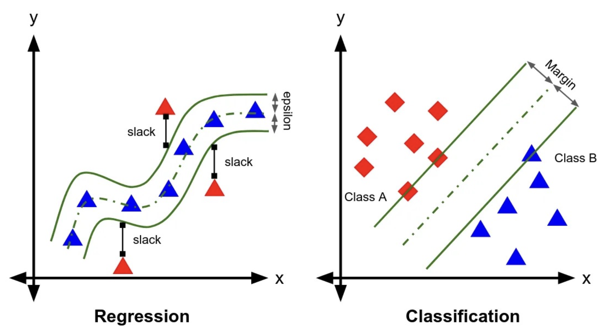

# 支持向量回归 Support Vector Regression

```admonish warning title="依赖提醒"
这一节内容依赖于 SVM 内容。如果你跳过了 SVM 也请跳过这一节。
```



支持向量机模型也可以应用在回归任务上。在支持向量回归（Support Vector Regression, SVR）中，我们的目标是找到一个函数 $f(\mathbf{x})$，使得其可以最小化数据点与函数之间的间隔。

