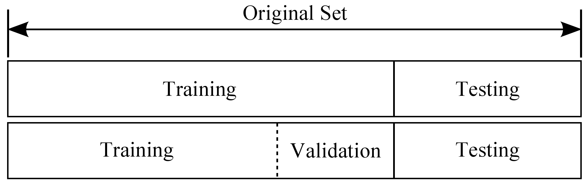
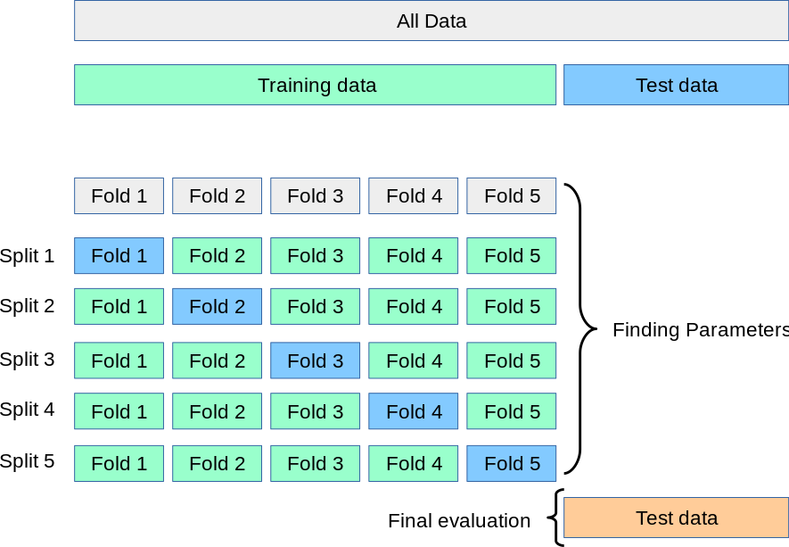

# 数据集分割与验证

## 从数据概念开始讲起

我们认为能学习数据都符合一定的假设，在统计学上认为则是数据遵循一定概率分布。例如可乐一定遵循一定概率分布，其概率分布可以理解为从可乐厂生产。可乐厂生产的每一瓶可乐（样本）可能都不同，我们可以认为每一份样本（可乐）都遵从一个可乐厂生产的概率分布。而每一瓶可乐（样本）都是从可乐厂生产（采样）出来的。而机器学习的目标是学会这个概率分布。我们将遵从一定的概率分布记作 $\sim$ ，$x$ 数据遵循 $P$ 概率分布则会被写作 $x \sim P$。机器学习做的另一个假设则为数据集是遵循最终概率分布的，即 $\mathcal{D} \sim P$​。

如果我们称呼用于直接训练模型的数据点称呼为**训练集（training set，$\mathcal{D}_\text{train}$）**。而我们期望模型通过学习现有观测数据（训练集），并尝试去在未见过的数据达到最好的性能。我们称通过先验经验以达到解决未见过的问题被为**泛化（Generalisation）**。我们期望获得最高的泛化性能。而我们需要一个模型从未见过的数据用于评估模型的泛化性能。我们称这个数据集为**测试集（testing set，$\mathcal{D}_\text{test}$）**。当然，我们一定不能让模型看到测试集，换句话说不能有泄露（Leakage）。

> **如果看见测试集会怎么样？**
> 让我们考虑一个学习的例子。上课老师总是在通过各种各样的题目让你学会知识（可以理解为在训练集上训练），平时测验尝试评估你学会知识没（通过测试集测试）。对于高中来说，我们期望在最终的高考取得好成绩，即我们通过平时的学习能够解决没见过的题目（泛化性能）。
>
> 但是如果每次平时测验，你都做过原题（训练了测试集），那么对于最终的平时测试，你可能次次满分，相对应的，测试集上的测试指标非常高。但是对于现实问题的泛化性能，我们不得而知。

那通过训练集和测试集，我们究竟在拟合什么呢？可能最直觉的答案是我们在拟合训练集整体的概率分布，这是没错的。但是如果考虑一个现实情况，如果我们把数据集分割为训练集和测试集，那么显然训练集，测试集和最终概率分布都可能会有轻微不一样：
$$
\mathcal{D} = \mathcal{D}_\text{train} \cup \mathcal{D}_\text{test}
\\
\mathcal{D} \sim P
\qquad \mathcal{D}_\text{train}
\sim P_\text{train}\qquad
\mathcal{D}_\text{test} \sim P_\text{test}\\

P \approx P_\text{test} \approx P_\text{train}
$$
考虑我们最终是以测试集指标作为评估标准，那么我们也可以认为我们其实际上**验证模型最终拟合测试集所对应的概率分布**。

## 验证集

如果一个模型拥有很多超参数，即机器学习并不能自动学习的参数，那么我们通常需要手动调整以确定最优值，我们称呼这个过程为**超参数调优（Hyperparameter Tuning）**。而我们依赖什么数据集进行调整呢？

如果我们直接在 $\mathcal{D}_\text{test}$​ 上进行调整，那我们其实在变相给模型透露了最终用于测试的数据集特征：我们期望其在测试集取最低的损失，意味着我们其实本质上在通过让模型去拟合测试集的概率分布，这里的问题是我们的间接透露了测试集的信息，这是绝不允许的。

那解决方案就是我们让模型拟合另一个单独的数据集，我们称之为**验证集**。其与训练和测试集均没有重合。

## 分割数据集

在实践中，我们通常不会将所有数据点都用于训练模型，而根据模型训练的不同阶段，将数据集划分为**训练集（training set，$\mathcal{D}_\text{train}$）**、**验证集（validation set，$\mathcal{D}_\text{valid}$，也称开发集，dev set）**和**测试集（testing set，$\mathcal{D}_\text{test}$​）**。

训练集用于训练模型，验证集通常用于查看新数据的状态和用于调整模型的超参数，测试集用于评估模型的性能。在划分数据集时，我们通常会将数据集的大部分数据用于训练集，只有一小部分数据用于验证集与测试集。

常见的划分比例是 70% 的数据用于训练集，10% 的数据集用于验证集，20% 的数据用于测试集。

需要注意的是，我们在划分数据集时，需要保证各个集合之间没有交集。

通过集合语言，因此我们有：

$$
\mathcal{D} = \mathcal{D}_\text{train} \cup \mathcal{D}_\text{test} \cup \mathcal{D}_\text{valid}\\
\mathcal{D}_\text{train} \cap \mathcal{D}_\text{test} = \emptyset\\
\mathcal{D}_\text{train} \cap \mathcal{D}_\text{valid} = \emptyset\\
\mathcal{D}_\text{test} \cap \mathcal{D}_\text{valid} = \emptyset
$$

用更形象的例子来解释不同数据集的作用的话，我们可以看作训练集是课本，验证集是模拟考试，测试集是真正的考试。我们通过课本（训练集）学习知识，通过模拟考试（验证集）查看自己的学习状态，通过真正的考试（测试集）来评估自己的学习成果。

## 留出法 Holdout

留出法是最简单的数据集划分方法，即最开始将数据集划分为训练集 $\mathcal{D}_\text{train}$ 和测试集 $\mathcal{D}_\text{test}$。然后从训练集中随机选择取出数据以创建验证集 $\mathcal{D}_\text{valid}$。

## 交叉验证 Cross Validation

在实际中，我们可能会遇到数据集较小的情况，此时我们可以使用交叉验证（Cross Validation）来更好的评估模型的性能。

[https://scikit-learn.org/stable/modules/cross_validation.html]

交叉验证是一种通过多次划分数据集来评估模型性能的方法。常见的交叉验证方法有：
- K 折交叉验证（K-Fold Cross Validation，KFCV）
- 留一法（Leave-One-Out Cross Validation，LOOCV）

### K 折交叉验证 K-Fold Cross Validation

K 折交叉验证是将训练集 $\mathcal{D}_\text{train}$ 划分为 $K$ 个大小相同的子集，将其中一个单独的子集保留用于为验证模型的数据，其他 $K-1$ 个子集用于训练。交叉验证重复 $K$ 次，每个子集验证一次，最后取 $K$ 次的验证结果的平均值作为最终的验证结果。

通常来说，我们会将数据集随机打乱（shuffle）后再进行 K 折交叉验证。且 $K$​ 通常取 5 或 10。

对于每组我们可以认为每个 Split，模型都会尝试拟合那个验证集上的概率分布。

### 留一法 Leave-One-Out Cross Validation

留一法是 K 折交叉验证的特例，即 $K=N$，其中 $N$ 是训练集 $\mathcal{D}_\text{train}$ 的大小。留一法的缺点是计算量大，但是由于每次只有一个样本作为验证集，因此留一法的结果是最准确的。

