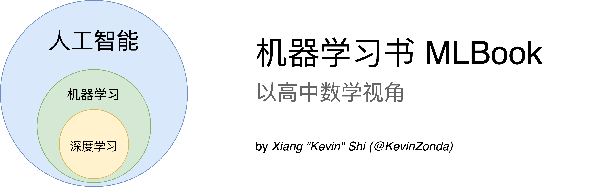

# 机器学习书：以高中数学视角

> 谨以此书，献给我的大学三年。  
> by KevinZonda

而在这里将更关注于机器学习中基础的数学和理论。相信学完，你可以获得对机器学习有基础理解。当然，在这个模块中，读者并不期望拥有高深的数学知识，只期望你能够理解以及能够运用高中数学知识。

本读物核心框架基于英国伯明翰大学本科课程 [LC Artificial Intelligence 1 (06 34238)](https://program-and-modules-handbook.bham.ac.uk/webhandbooks/WebHandbooks-control-servlet?Action=getModuleDetailsList&pgSubj=06&pgCrse=34238&searchTerm=002022)、[LI Artificial Intelligence 2 (06 34255)](https://program-and-modules-handbook.bham.ac.uk/webhandbooks/WebHandbooks-control-servlet?Action=getModuleDetailsList&pgSubj=06&pgCrse=34255&searchTerm=002022)、[LH Machine Learning (06 38965)](https://program-and-modules-handbook.bham.ac.uk/webhandbooks/WebHandbooks-control-servlet?Action=getModuleDetailsList&pgSubj=06&pgCrse=38965&searchTerm=002023)、[LH Neural Computation (06 32167)](https://program-and-modules-handbook.bham.ac.uk/webhandbooks/WebHandbooks-control-servlet?Action=getModuleDetailsList&pgSubj=06&pgCrse=32167&searchTerm=002022) 得来。内容并不完全重合。

这是本关于机器学习基础入门的书籍，并假设了你拥有高中的数学基础，主要包括以下几个部分：

- [1.机器学习基础](./1-Basic/)
  - [1.1 机器学习概览](./1-Basic/1.1-Overview.md)
  - [1.2 高中数学复习](./1-Basic/1.2-MathRecap.md)

## 感谢列表

- [@PassingWang](https://github.com/PassingWang)：审计者（可读性）
- [@George-Miao](https://github.com/George-Miao)：审计者（数学）
