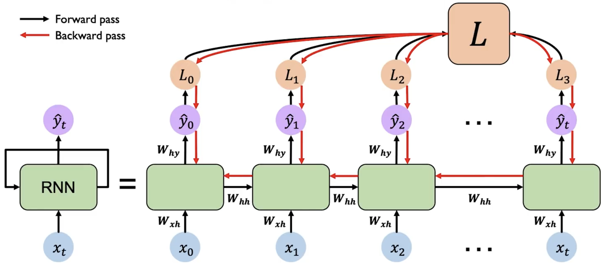

# 循环神经网络 RNN

考虑我们输入的是一个序列信息，而序列信息的特性是不定长度，除了我们将模型输入层拉长到非常长去覆盖所有可能的长度，我们还可以使用循环神经网络（Recurrent Neural Network, RNN）来处理这种序列信息。

## 模型

RNN 是一种特殊的神经网络，它的特点是在网络中引入了循环结构，使得网络可以保持一定的记忆。在 RNN 中，我们可以将隐藏层的输出 $h_t$ 作为下一个时间步的输入的一部分，这样就可以将序列信息传递下去。

上图是 RNN 模型的示意图。左侧是简略图，右侧则为其展开后的结构。

我们关注其中任意一个时间步 $t$ 的计算过程：

其先接受输入 $x_t$，然后结合上一个时间步的隐藏层输出 $h_{t-1}$，计算出当前时间步的隐藏层输出 $h_t$。而输出 $\hat{y}_t$ 也是根据 $h_t$ 和 $x_t$ 计算得到的。重复执行这个操作，我们就可以处理整个序列的信息。

对于第一个时间步，由于其没有上一个时间步的 $h_{t-1}$，我们可以初始化一个全零的隐藏层输出 $h_0$，或者使用一个特殊的向量来初始化。

用数学公式表示，RNN 在时间步 $t$ 的计算过程如下：
$$
\begin{aligned}
h_t &= f(x_t, h_{t-1}) \\
\hat{y}_t &= o(x_t, h_{t-1})
\end{aligned}
$$

其中 $f$ 和 $o$ 是两个函数，分别表示隐藏层和输出层的计算过程。我们可以将其展开为更具体的形式：

$$
\begin{aligned}
h_t &= \tanh(W^T_{hh}h_{t-1}+W^T_{hx}x_{t})\\
\hat{y}_t &= W_{hy}h_t
\end{aligned}
$$

需要注意的是，RNN 的参数 $W_{hh}$ 、 $W_{hx}$ 和 $W_{hy}$ 在所有时间步都是共享的。因此其实 RNN 只有 3 个权重矩阵，而不是每个时间步都有一个独立的权重矩阵。

## 训练

RNN 的训练过程与普通的神经网络类似，我们可以使用梯度下降法来更新参数。但是由于 RNN 的循环结构，我们需要使用反向传播算法的变种——BPTT（Backpropagation Through Time）来计算梯度。

每一个时刻 $t$ 都会产生一个 loss $L_t$，我们需要将所有时刻的 loss 求和 $L=\sum_t L_t$，然后从最后一个时间步开始，沿着展开的网络反向传播误差。在每个时间步，根据链式法则计算损失对参数的梯度。由于参数共享，需要将每个时间步的梯度累加起来，得到最终的梯度。

而由于 RNN 的循环结构，在反向传播过程中，对于 $h_0$ 计算梯度时，导致很多梯度会相乘，从而导致梯度可能会指数级地减小（消失）或增大（爆炸）。这会导致学习困难，尤其是对于长序列。

如果梯度很多都 $>1$，则会导致梯度爆炸（考虑 $1.01^{100}$），我们可以通过梯度裁剪（Gradient Clipping）来解决这个问题。即当梯度的范数超过一个阈值时，将梯度缩放到一个较小的范围。

如果梯度很多都 $<1$，则会导致梯度消失，这个问题比较难解决，我们通常会使用
1. 更换激活函数，如 ReLU
2. 魔法权重初始化
3. 使用 LSTM 或 GRU 等更复杂的结构（后续会介绍）

对于更换激活函数，我们可以使用 ReLU 来代替 tanh 函数，这样可以减缓梯度消失的问题。因为梯度消失是由于 tanh 函数的性质导致的，当输入很大或很小时，梯度会接近于 0。而 ReLU 函数在输入大于 0 时梯度为 1，可以减缓梯度消失的问题。

而权重初始化则是经验行为，使用单位矩阵作为初始权重，并令所有的bias为0，可以减缓梯度消失的问题。